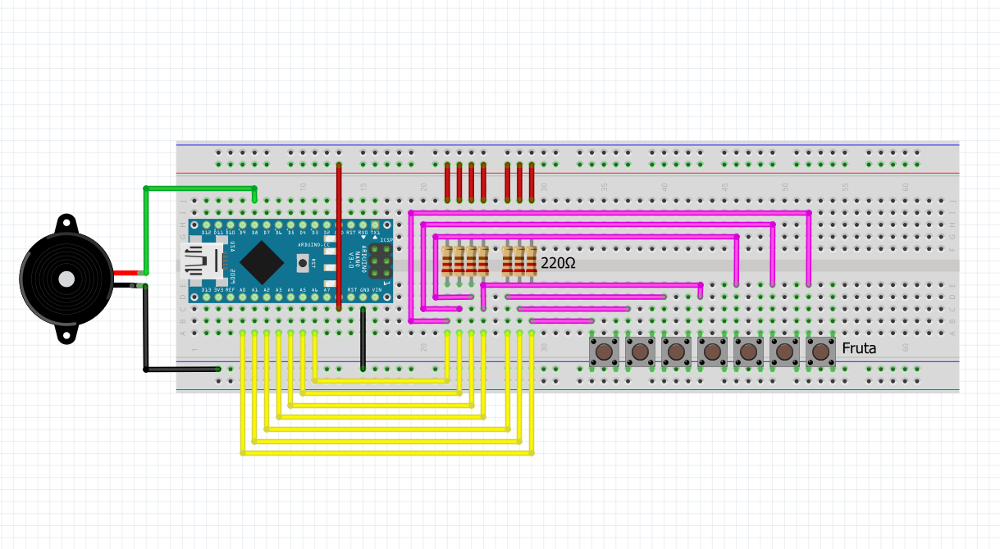

# 🍋 Arduino Lemon Piano

**A university Arduino game (02/2019), rescued in 2026.** Seven lemons wired to
an Arduino Nano become a touch keyboard. Guess the secret 10-note Mario melody:
green LED when you're right, red when you're wrong — and if you fail near the
end, a relay fires a **water pump that sprays you**. Ten penalties and the
Mario *death* tune declares you dead.

<div align="center">

<br/><em>Keyboard stage of the circuit — on the real build, each button is a lemon + the player's body.</em>
</div>

---

## How the game works

1. **Power on.** Hold the game-select button (D4) during boot to get **game 1
   (Mario Main Theme)**; leave it released for **game 2 (Underworld Theme)**.
2. **Touch lemons.** Hold the 5 V clip in one hand and touch a lemon with the
   other — your body closes the circuit and the note plays on the buzzer.
3. **Guess the secret sequence** (10 notes). Correct note → green LED.
   Wrong note → red LED and the sequence resets to the beginning.
4. **Water penalty.** A mistake from note 7 onwards fires the relay pair
   (D5/D6) for 1 second → the water pump sprays the player, with a low
   `NOTE_D1` groan on the buzzer.
5. **Death.** 10 penalties → any touch replays the Mario death melody.
6. **Victory.** All 10 notes right → the song continues from where the
   sequence left off (the trimmed melody), and penalties reset.
7. **Restart** anytime with the button on D7 (re-runs game selection).

### Secret codes (spoilers!)

Keys numbered 1–7, left to right:

| Game | Melody | Code |
|---|---|---|
| 1 | Super Mario Bros — Main Theme | `6, 5, 6, 7, 2, 5, 2, 1, 3, 4` |
| 2 | Super Mario Bros — Underworld Theme | `3, 6, 1, 4, 2, 5, 3, 6, 1, 4` |

| Key | 1 | 2 | 3 | 4 | 5 | 6 | 7 |
|---|---|---|---|---|---|---|---|
| Game 1 note | E6 | G6 | A6 | B6 | C7 | E7 | G7 |
| Game 2 note | A3 | A#3 | C4 | A4 | A#4 | C5 | D5 |

## Hardware

| Component | Qty | Notes |
|---|---|---|
| Arduino Nano (ATmega328P) | 1 | Uno also works (original banana piano used one) |
| Lemons 🍋 + alligator clips | 7 + 8 | 7 keys + 1 hand-held 5 V clip |
| 220 Ω resistors | 7 | in series with each key |
| Passive buzzer | 1 | D8 |
| Red + green LEDs | 2 | D2 / D3 |
| Push buttons | 2 | game select (D4), restart (D7) |
| 2-channel relay module | 1 | D5 / D6 |
| Water pump + bottle | 1 | the penalty hardware 💦 |

Full pin map, the deduced wiring, and how the touch sensing actually works:
**[docs/HARDWARE.md](docs/HARDWARE.md)**.

## Repo layout

```
arduino-lemon-piano/
├── README.md                    ← you are here
├── firmware/                    ← ACTIVE code — PlatformIO project (translated V4)
│   ├── platformio.ini           ← envs: nanoatmega328 (default) · nanoatmega328new · uno
│   ├── src/main.cpp             ← the game (1:1 English translation of Piano_Limones_v4.ino)
│   └── include/notes.h          ← note frequency table
├── docs/
│   ├── HARDWARE.md              ← deduced schematic, pin map, sensing explained
│   ├── keyboard-schematic.fzz   ← editable Fritzing source
│   └── images/                  ← breadboard diagrams
├── archive/
│   └── banana-piano-original/   ← frozen 2019 reference code (translated)
│       ├── banana-piano/        ← the original banana piano (untitled.es tutorial base)
│       ├── keyboard-test/       ← 7-key piano test, no game logic
│       └── game-prototype/      ← v3-era game (Uno, inverted threshold) — v4's ancestor
└── TODO.md                      ← known bugs & fix roadmap (next work sessions)
```

## Quick start

```bash
# Install PlatformIO CLI once (any of):
pipx install platformio          # or: pip install --user platformio

cd firmware
pio run                          # build (default env: nanoatmega328, old bootloader)
pio run -t upload                # flash the Nano
pio run -e nanoatmega328new -t upload   # if upload fails: new-bootloader Nano
pio run -e uno -t upload         # or an Uno
```

No hardware needed to build — `pio run` is the compile check used before
committing.

## Rescue notes (2026-07-12)

The 2019 originals are preserved **verbatim** in git history (commit
`rescue: original 2019 lemon piano files`). What changed since:

- Everything translated to English: folder/file names, comments, identifiers.
- `Piano_Limones_v4.ino` → `firmware/src/main.cpp` (PlatformIO layout).
- **One functional reconstruction:** the `Duracion` constant line was corrupted
  by accidental keystrokes (`= 5çkp\`ñ´sca…0;`) — the file did not compile as
  recovered. Restored to `NOTE_DURATION = 50` (ms), consistent with the remnant
  digits and the comment "the lower, the better the feel" (the v3 prototype
  used 150).
- The 1:1 English translation was committed first (commit
  `restructure: translate to English…`), then the **2019 bugs were fixed**
  (TODO #1–#12): edge-triggered input so repeated notes are playable, `millis()`
  timing, melodies in `PROGMEM` (RAM 38 % → 15 %), auto-calibrated touch, and a
  clean game state machine that no longer false-fails after a win. Details in
  [CHANGELOG.md](CHANGELOG.md); remaining hardware items in [TODO.md](TODO.md).

## Lineage

1. **Banana piano** ([untitled.es](http://untitled.es) tutorial) — 7 fruit
   keys playing fixed notes on an Uno. → `archive/banana-piano-original/banana-piano/`
2. **Game prototype (v3)** — adds the secret-sequence game, LEDs, one relay.
   → `archive/banana-piano-original/game-prototype/`
3. **Lemon Piano V4 (02/2019)** — Nano, inverted touch threshold, two games,
   water-pump penalty, death melody. → `firmware/` (this is the rescued code)

---

*Author: Yupipi93 (Sergio Conejero), 2019 · Rescued & documented with Claude, 2026*
