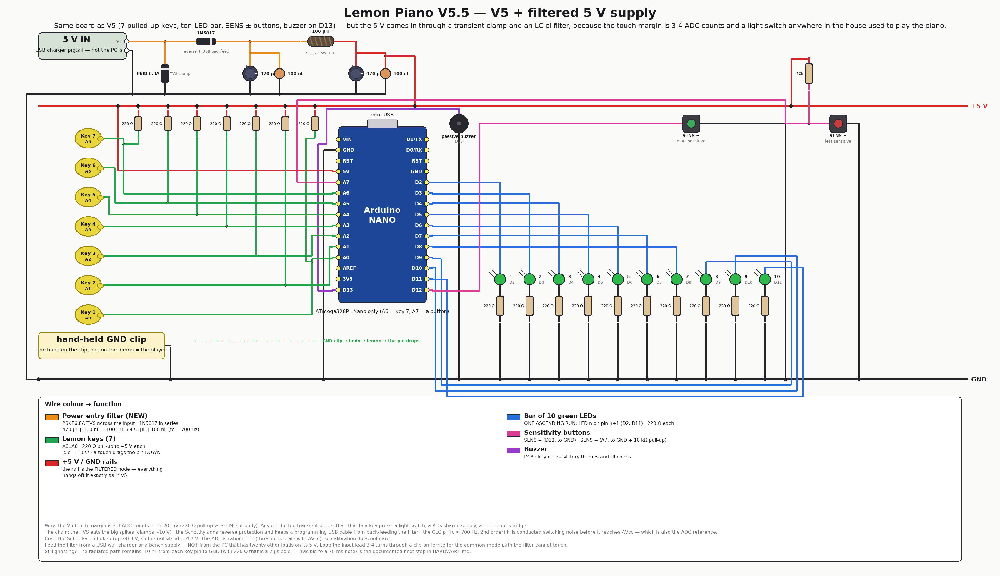

# 🍋 Arduino Lemon Piano

**A university Arduino game (02/2019), rescued and still evolving in 2026.**
Seven lemons wired to an Arduino Nano become a touch keyboard: hold a clip in one
hand, touch a lemon with the other, and your body closes the circuit. Guess the
secret 10-note Mario melody and the theme plays.

The project is organised as **one version per hardware revision** — seven boards so
far, from a bare buzzer bring-up rig and the 2019 banana-piano tutorial to today's
ten-LED progress bar.
**Every version is active**: each keeps its own firmware, browser emulation,
wiring diagram and docs, and each is expected to build. There is no archive.

<div align="center">

<br/><em>The newest board (V5.5): 7 lemon keys, a ten-LED progress bar — and a filtered 5 V supply, because a light switch used to play the piano.</em>
</div>

## The versions

| # | Version | Hardware delta vs previous | Emulation |
|---|---|---|---|
| 0 | [**V0** — buzzer rig](versions/v0-buzzer/) | *bring-up (2026)*: one passive buzzer on D8 and nothing else — plays a scale forever, to test the sound in isolation | ✅ verify green |
| 1 | [**V1** — banana piano](versions/v1-banana-piano/) | *the 2019 origin*: + 7 fruit keys + 220 Ω pull-ups, + HC-SR04 (code commented out) | — |
| 2 | [**V2** — keyboard test](versions/v2-keyboard-test/) | − HC-SR04: the keyboard and speaker alone, for measuring the keys | — |
| 2.5 | [**V2.5** — live threshold](versions/v2.5-threshold-buttons/) | + 2 buttons that tune the touch threshold **while it runs** (D10/D11), serial readout of every reading and note | ✅ verify green |
| 3 | [**V3** — game prototype](versions/v3-game-prototype/) | + red/green feedback LEDs, game-select button, one relay channel — the game is born | — |
| 4 | [**V4** — water pump](versions/v4-water-pump/) | clip flips to **+5 V** (sensing inverted), Nano, 2nd relay channel + **water pump**, RESTART button | ✅ verify green |
| 5 | [**V4.5** — margin buttons](versions/v4.5-margin-buttons/) | **− relay pair + water pump** · + MARGIN +/− buttons (D10/D11) to tune touch sensitivity live | ✅ verify green |
| 6 | [**V5** — LED bar](versions/v5-led-bar/) | *rebuilt 2026-07-28*: keyboard back to **220 Ω pull-ups + GND clip** · + **ten green LEDs** · + 2 live-sensitivity buttons · − game-select, − restart | ✅ verify green |
| 7 | [**V5.5** — power filter](versions/v5.5-power-filter/) ⭐ newest | + **filtered 5 V input** (TVS + Schottky + CLC pi, fc ≈ 700 Hz): the 3-4-count touch margin no longer hears the house wiring | V5's |

Details, pin maps and per-board build commands: [versions/README.md](versions/README.md).
The methodology (what counts as a new version, and the checklist for adding one):
[docs/VERSIONING.md](docs/VERSIONING.md).

## How the newest board (V5) plays

1. **Power on.** The A7 game-select switch picks the **starting** game: 5 V = game
   1 (Mario Main Theme), GND = game 2 (Underworld).
2. **Touch lemons.** Hold the 5 V clip in one hand, touch a lemon with the other —
   the note plays on the buzzer.
3. **Guess the secret sequence** (10 notes). Each correct note lights the next
   green LED; a wrong note **blanks all ten** and the sequence restarts.
4. **Victory + auto-advance.** All ten lit → that level's theme plays in full
   with the bar progressively counting back up from empty to all ten as it
   plays, then the flagpole fanfare, then the next
   level announces itself (its own theme's opening notes) before play moves on
   to the next of the **four levels**. Clearing level 4 instead loops the
   game-complete piece until you hold both sensitivity buttons for 1 s, which
   resets straight to level 1 without recalibrating.
5. **Restart** anytime with the D7 button (re-reads game select, recalibrates).

### Secret codes (spoilers!)

Keys numbered 1–7, left to right. These two codes have been the same since V3:

| Level | Theme | Code |
|---|---|---|
| 1 | Super Mario Bros — Overworld / Main Theme | `6, 5, 6, 7, 2, 5, 2, 1, 3, 4` |
| 2 | Super Mario Bros — Underworld | `3, 6, 1, 4, 2, 5, 3, 6, 1, 4` |
| 3 | Super Mario Bros — Starman | `2, 4, 6, 1, 5, 3, 7, 4, 2, 6` |
| 4 | Super Mario Bros — Castle | `5, 1, 3, 7, 2, 6, 4, 1, 5, 3` |

Clear all four and the **game-complete piece** plays on a loop until reset.
Every non-key sound is a Mario effect (coin, power-up, 1-up, death, flagpole
fanfare) — the note data and its provenance are in
[docs/MARIO-SOUNDS.md](docs/MARIO-SOUNDS.md).

## Quick start

```bash
# Install PlatformIO CLI once (either):
pipx install platformio          # or: pip install --user platformio

cd versions/v5-led-bar/firmware  # ← or any other version's firmware/
pio run                          # build (default env: nanoatmega328, old bootloader)
pio run -t upload                # flash the Nano
pio run -e nanoatmega328new -t upload   # if upload fails: new-bootloader Nano
```

No hardware needed to build — `pio run` is the compile check used before
committing. Every version builds in place, including the 2019 sketches.

## 🎮 Play it in the browser (no hardware)

V0, V2.5, V4, V4.5 and V5 each run in an interactive
[Velxio](https://github.com/davidmonterocrespo24/velxio) emulation — real firmware
on an emulated ATmega328, clickable lemons, audible buzzer:

```bash
cd versions/v5-led-bar
PIPE=../../../velxio-multi-board-emulator/harness/.venv/bin/velxio-pipeline
$PIPE stack up
# then open http://localhost:3080/editor and import emulation/lemon-piano.vlx → Run
$PIPE run --mode verify --spec emulation/lemon-piano.yaml --out emulation/runs   # headless regression test
```

Each of those versions also has a headless `verify` run — V4/V4.5/V5 play a secret
code by injecting timed key presses and assert the game logs `WIN`; V0 asserts the
buzzer pin toggles through its scale and that the scale repeats. All four:
**pass** (2026-07-26).

## Repo layout

```
arduino-lemon-piano/
├── README.md                      ← you are here
├── versions/                      ← ONE DIRECTORY PER HARDWARE REVISION (all active)
│   ├── README.md                  ← the version index / comparison table
│   ├── v0-buzzer/                 ← buzzer bring-up rig (diagnostic)
│   ├── v1-banana-piano/           ← firmware · emulation notes · images · docs
│   ├── v2-keyboard-test/
│   ├── v2.5-threshold-buttons/    ← keyboard + live threshold (instrument)
│   ├── v3-game-prototype/
│   ├── v4-water-pump/
│   ├── v4.5-margin-buttons/
│   └── v5-led-bar/                ← newest board
│       ├── README.md · HARDWARE.md
│       ├── firmware/              ← PlatformIO project
│       ├── emulation/             ← Velxio spec + generated .vlx
│       └── images/                ← wiring-v5.png (wirewright-rendered)
├── docs/
│   ├── VERSIONING.md              ← what counts as a version + how to add one
│   ├── MARIO-SOUNDS.md            ← every Mario melody/SFX: notes + provenance
│   ├── HARDWARE.md                ← shared fundamentals: touch physics, polarity, parts
│   ├── keyboard-schematic.fzz     ← editable Fritzing source (keyboard stage)
│   └── images/                    ← shared reference images
├── tools/
│   └── wiring_diagrams.py         ← the diagram contract for EVERY version (wirewright)
├── CHANGELOG.md · TODO.md · CLAUDE.md
```

## Wiring diagrams

Every version's `images/wiring-*.png` is **generated**, never hand-drawn:
[tools/wiring_diagrams.py](tools/wiring_diagrams.py) is a declarative contract
(components, positions, nets) consumed by the reusable **wirewright** engine
(auto-router + DRC — no wire crosses a component, overlaps another net, or leaves
a pin unconnected). Re-render everything, or one version:

```bash
python3 tools/wiring_diagrams.py            # all eight
python3 tools/wiring_diagrams.py v3 v4.5    # just these
```

The engine lives in its own repo (`../eda-wirewright`) and is also available as a
cloud API — see [CLAUDE.md](CLAUDE.md).

## Something sounds wrong?

Flash [**V0**](versions/v0-buzzer/) — a board with nothing on it but the buzzer,
playing a scale forever, on the same D8 pin every version uses. It removes the
keyboard, the sensing and the game from the picture in one step:

```bash
cd versions/v0-buzzer/firmware && pio run -t upload && pio device monitor
```

## History

- **2019 originals** preserved in git history (commit
  `rescue: original 2019 lemon piano files`), and still buildable as V1–V3.
- **V4** (02/2019) — the university build: lemons, Nano, relay water pump, death
  melody. English translation, PlatformIO layout and the TODO #1–#12 fix pass
  landed on it in 2026.
- **V4.5** (2026-07-25/26) — relay pair and water pump removed; noise-adaptive
  touch calibration + two MARGIN buttons.
- **V5** (2026-07-14) — relays/pump/red LED out, ten-LED progress bar in,
  auto-advancing games.
- **V5.5** (2026-07-29) — power-entry filter on the 5 V input; board and game
  untouched. Designed after mains transients (a light switch!) played phantom
  notes through the 15-20 mV touch margin.

Version numbers follow the **boards**, not the calendar: V4.5 is V4 minus the pump
plus two buttons, so it sits before V5 even though it was wired later. Full story in
[CHANGELOG.md](CHANGELOG.md).

---

*Author: Yupipi93 (Sergio Conejero), 2019 · Rescued, reworked & documented with Claude, 2026*
