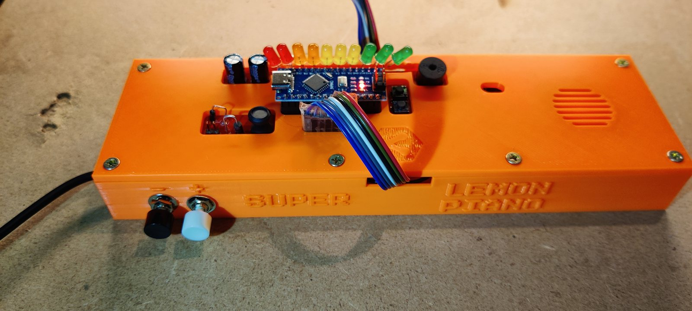
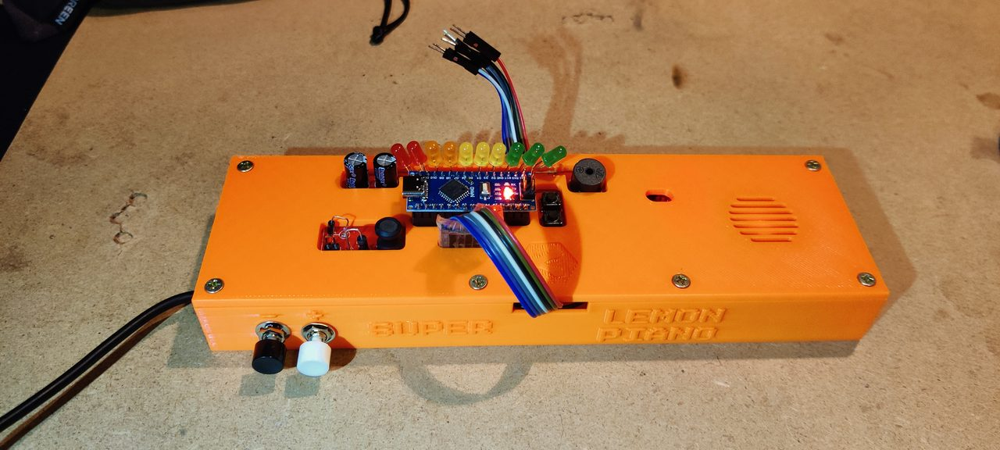
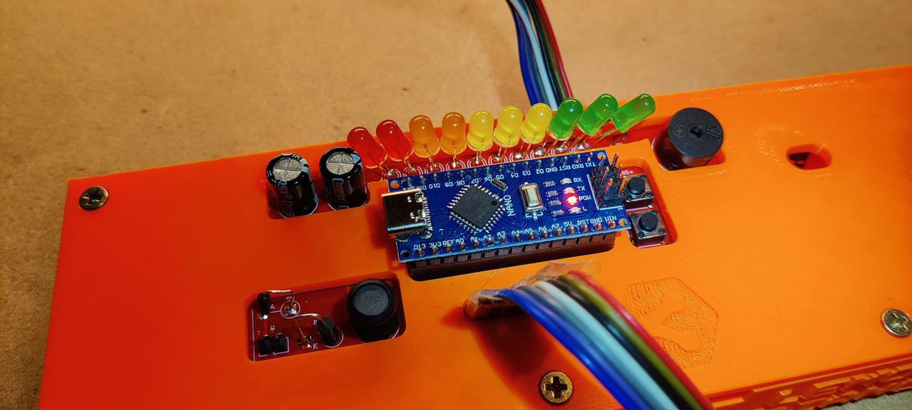
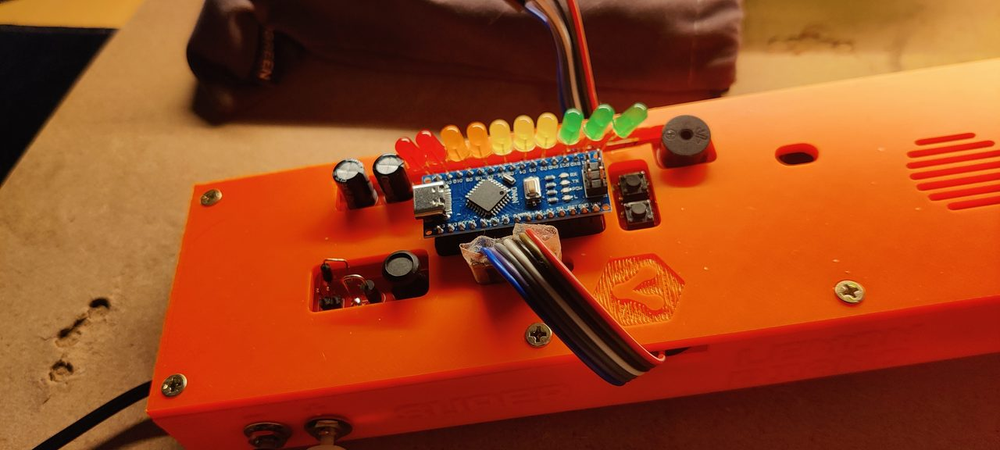
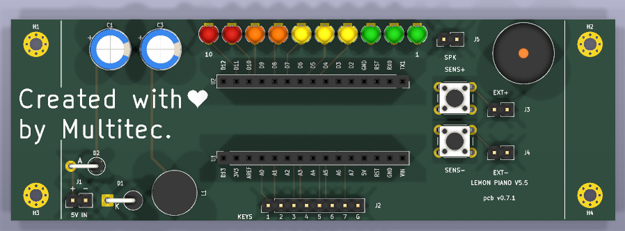
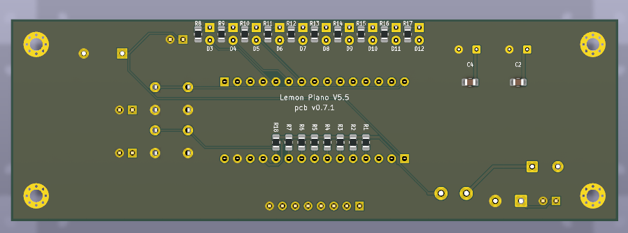
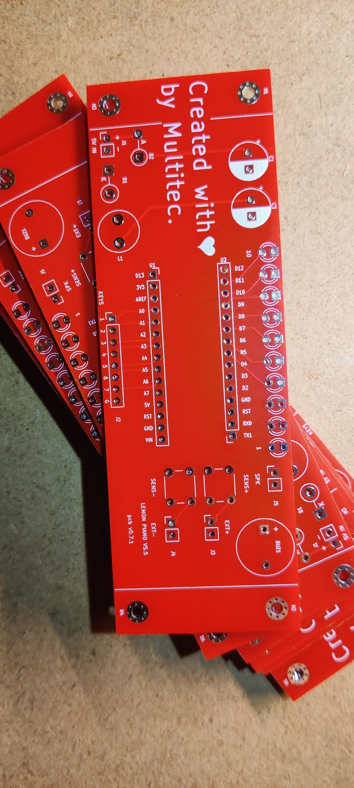
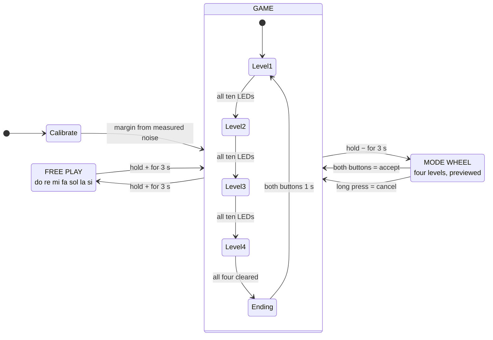
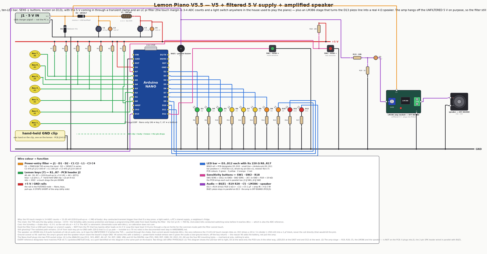
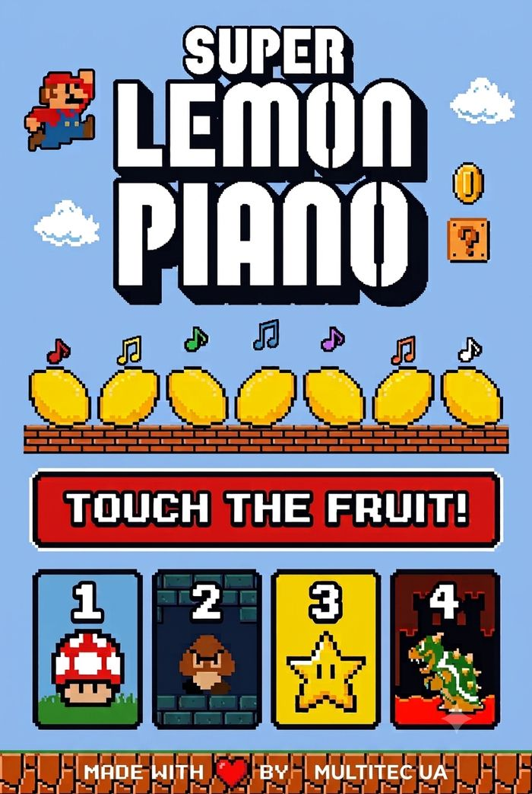

<div align="center">



# 🍋 Super Lemon Piano

**Seven lemons, an Arduino Nano and a secret Mario melody.**
A 2019 university project, rescued in 2026 and still growing — nine boards, a
fabricable PCB, a printed case, and a firmware that is tested on a fake board
before it ever touches fruit.

[](versions/v5.5-power-filter/)
[](versions/v5.5-power-filter/HARDWARE.md)
[](versions/)
[](pcb/)
[](versions/v5.5-power-filter/firmware/)
[](versions/v5.5-power-filter/firmware/test/)

</div>

---

## What it is

Hold a ground clip in one hand and touch a lemon with the other: your body closes
the circuit, the pin drops **three or four ADC counts**, and a note sounds. Seven
lemons make a keyboard. Each of the **four levels** hides a ten-note Mario melody
— the game plays you the hook, you find the notes, and ten green LEDs count how
close you are. Get it and the whole theme plays as a celebration; miss and the bar
blanks and you start that level again. There is also a fifth mode with no game in
it at all, where the lemons are simply *do re mi fa sol la si*.

The repo is organised as **one directory per hardware revision, all of them
active**. Nothing is archived: a bare-buzzer bring-up rig, the 2019 banana-piano
original, the water-pump build that was handed in at university, and today's
filtered ten-LED board each keep their own firmware, wiring diagram, emulation and
docs — and each is expected to build.

| Read | For |
|---|---|
| [**USER-GUIDE.md**](docs/USER-GUIDE.md) · [en español](docs/GUIA-DE-USO.es.md) | Playing it. The printable sheet — no electronics in it |
| [**versions/**](versions/) | The nine boards, what changed between them, and why |
| [**pcb/**](pcb/) | The fabricable KiCad 9 board, its renders and its gerbers |
| [**docs/HARDWARE.md**](docs/HARDWARE.md) | Touch physics, the polarity flip, the shared parts |
| [**docs/MARIO-SOUNDS.md**](docs/MARIO-SOUNDS.md) | Every melody and effect, with its provenance |
| [**docs/cartilla/**](docs/cartilla/) | The one-page folded booklet an organiser carries to an event |
| [**CHANGELOG.md**](CHANGELOG.md) · [TODO.md](TODO.md) | What changed, and what is still open |

---

## The thing itself

<div align="center">

<br/><em><b>SUPER LEMON PIANO</b> — printed case, ten-LED bar, passive buzzer behind the grille,<br/>two sensitivity buttons on the front, and a ribbon cable out to the fruit.</em>
</div>

<table>
<tr>
<td width="50%">

<br/><em>The ten LEDs run red → yellow → green, so how far you are is readable across a room. Left of the Nano: the 470 µF halves of the CLC pi filter.</em>
</td>
<td width="50%">

<br/><em>Seated in the case, with the Multitec logo embossed in the print. The ribbon leaves through a slot so the lid closes on a working piano.</em>
</td>
</tr>
</table>

### The PCB

<div align="center">

<br/><em>v0.7.1, top — LEDs north, keys south, Nano socketed with the USB facing west.</em>
<br/><br/>

<br/><em>Bottom — a full ground pour, and every 220 Ω pull-up on B.Cu.</em>
</div>

<div align="center">

<br/><em>Back from the fab house. <b>Created with ♥ by Multitec.</b></em>
</div>

---

## How it plays

1. **Power on.** The bar counts up while the firmware measures what *untouched*
   looks like on every lemon and derives the touch margin from the noise it finds.
   **Lights running = hands off the fruit.**
2. **It announces the level** with seven notes of that level's theme — and only
   notes your lemons can make (see *Three sizes of every song* below).
3. **Play.** Hold the GND clip, touch a lemon. The note sounds and holds for as
   long as you hold the fruit.
4. **Find the ten-note code.** Each correct note lights the next green LED. A
   wrong note blanks all ten and that level restarts. Nothing is punished until
   you have found the first note, so you can explore freely.
5. **Light all ten** and the level's **whole theme** plays as a celebration, then
   the flagpole fanfare, then the next level announces itself.
6. **Forgotten the tune?** **Tap the same lemon five times** and it plays again.

### The gestures

| Gesture | What it does |
|---|---|
| **tap +** / **tap −** | one step more / less sensitive — the bar shows where the knob sits |
| **hold + for 3 s** | switch between **free play** and the level you were on |
| **hold − for 3 s** | open the **mode wheel**: turn with + / −, accept with both buttons |
| **both buttons, 1 s**, while touching a lemon | **smart adjust** — learn the best margin from that real touch |
| **the same lemon ×5** | **play the level's tune again**. The note you just played counts as the first, so it is four more taps. It changes nothing: repeats never score |

### Free play

Hold **+** for three seconds and the game gets out of the way: the seven lemons
become `do re mi fa sol la si` (C5–B5), there is no code and no wrong note, and
**the same lemon may be played over and over** — which is exactly what the game
forbids, and exactly what an instrument is for.

The bar in free play **only ever moves**. Entering runs a sweep: two lights walk
in from the ends of the bar, meet in the middle, open back out until all ten are
lit, and go out. After that it is dark, and every note breaks a **wave** from that
lemon's own place on the bar — lemon 1 sends it left to right, lemon 7 right to
left, a lemon in the middle opens it both ways at once. Hold two lemons together
and both notes sound: one buzzer cannot hold two frequencies, so the voices swap
it every 10 ms, fast enough that the ear hears an interval instead of an
alternation.

### Three sizes of every song

Each theme exists at three lengths, because three different moments need three
different things:

| Size | Where | What it is |
|---|---|---|
| **Short** | the mode wheel | eight notes. Browsing four modes has to be fast |
| **Playable** | the level announcement, and the five-tap reminder | **seven notes, and only notes that level's lemons can make** |
| **Full** | the celebration when a level is cleared | the whole piece, 10–23 s |

The middle one is the clue, so it must not be full of notes the keyboard cannot
answer with — every theme reaches pitches that are on no lemon. The firmware
walks the theme, plays only what the level's row contains, and turns anything
else into silence of the same length so the rhythm of the hook survives. It lands
on each theme's actual hook, which is a pleasant accident of how Mario wrote them:

| Level | Theme | What it announces | The seven lemons, low → high |
|---|---|---|---|
| 1 | Overworld | `E7 E7 E7 C7 E7 G7 G6` — the riff, exactly | E6 G6 A6 B6 C7 E7 G7 |
| 2 | Underworld | `C4 C5 A3 A4 AS3 AS4 C4` | A3 AS3 C4 D4 A4 AS4 C5 |
| 3 | Starman | `C6 F5 F5 D5 F5 F5 D5` | C5 D5 E5 F5 G5 A5 C6 |
| 4 | Castle | `G3 D4 G3 D4 AS3 D4 AS3` — the pedal | G3 AS3 C4 D4 DS4 F4 G4 |

**Every lemon on every level is a note that level's own theme plays.** That is a
rule with a test behind it, not a convention — it was broken on levels 2, 3 and 4
until 2026-09-15, and level 4 answered a G-minor theme with a C major scale an
octave up.

<details>
<summary><b>The four secret codes (spoilers)</b></summary>

<br/>

Lemons numbered 1–7, left to right — lemon 1 is the one that sounds **lowest**.

| Level | Theme | Code |
|---|---|---|
| 1 | Super Mario Bros — Overworld | `6 · 5 · 6 · 7 · 2 · 5 · 2 · 1 · 3 · 4` |
| 2 | Super Mario Bros — Underworld | `3 · 6 · 1 · 4 · 2 · 5 · 3 · 6 · 1 · 4` |
| 3 | Super Mario Bros — Starman | `2 · 4 · 6 · 1 · 5 · 3 · 7 · 4 · 2 · 6` |
| 4 | Super Mario Bros — Castle | `5 · 1 · 3 · 7 · 2 · 6 · 4 · 1 · 5 · 3` |

Clear all four and the game-complete piece loops until you hold both buttons.

These numbers are **never typed by hand**. A level's code lives in the firmware as
note *frequencies*, and which lemon plays which note differs per level, so the
answer exists nowhere in the source. [`docs/cartilla/seqs.py`](docs/cartilla/seqs.py)
resolves one table against the other, cross-checks level 1 against a sequence the
host test declares independently, and exits non-zero rather than guess.

</details>

---

## The modes, as a machine



Free play is **chosen, never earned**: winning cycles 1 → 2 → 3 → 4 → 1 and never
lands on it.

---

## Hardware

<div align="center">

<br/><em>Every wiring diagram in this repo is <b>generated</b>, never hand-placed — see below.</em>
</div>

### Pin map (V5.5)

| Pin | What | Notes |
|---|---|---|
| `A0`–`A6` | lemon keys 1–7 | 220 Ω pull-up each; the player holds the **GND** clip |
| `D2`–`D11` | the ten-LED bar | LED *n* on pin *n+1* — nothing to look up |
| `D12` | **SENS +** button | to GND, internal pull-up |
| `A7` | **SENS −** button | analog-in only, so an external 10 kΩ pull-up; read as `< 512` |
| `D13` | passive buzzer | the Nano's own LED blinks with the audio, for free |

Needs a **Nano or Mini**: A6 is a key and A7 is a button, and the classic Uno
exposes neither.

### The board

| | |
|---|---|
| **Outline** | 120 × 40 mm, 2-layer FR4, 4 × M2 mounting |
| **MCU** | Arduino Nano, socketed, centred, mini-USB facing west |
| **Display** | 10 × Ø3 mm LEDs, north edge — 3 green, 3 yellow, 2 orange, 2 red |
| **Keys** | 1×8 header on the south edge, silk reads `KEYS 1 2 3 4 5 6 7 G` |
| **Sound** | passive buzzer + an `SPK` aux header in parallel with it |
| **Power** | `5V IN` → P6KE6.8A TVS → 1N5817 → 470 µF‖100 nF → 100 µH → 470 µF‖100 nF |
| **Status** | v0.7.1 — DRC 0/0/0, ERC 0/0, placement 74/0, geometry gate 30/30 |
| **Fab** | [`pcb/releases/v0.7.1/`](pcb/releases/v0.7.1/) — gerbers, drill, BOM, positions |

<details>
<summary><b>Why there is a filter on a 5 V input at all</b></summary>

<br/>

A touch is **3–4 ADC counts, about 15–20 mV** — skin is roughly 1 MΩ against a
220 Ω pull-up, which is a very lopsided divider. The +5 V rail is simultaneously
the top of all seven pull-ups **and AVcc, the ADC's own reference**. A slow sag
cancels out, because the ADC is ratiometric and baseline and reading move
together. A **fast edge does not**: the pin node sits behind 220 Ω and wire
capacitance while the reference goes straight into AVcc, so the two move at
different speeds and the difference lands squarely inside a 15 mV margin.

Which is not theory. A light switch elsewhere in the house played phantom notes.
The filter (TVS + Schottky + CLC pi, fc ≈ 730 Hz) is V5.5's entire hardware
delta; the game and the firmware pinout are V5's, untouched.

Full derivation: [`versions/v5.5-power-filter/HARDWARE.md`](versions/v5.5-power-filter/HARDWARE.md).
Running it off a battery instead: [`docs/POWER-FROM-A-POWER-BANK.md`](docs/POWER-FROM-A-POWER-BANK.md).

</details>

---

## Quick start

```bash
# PlatformIO CLI, once
pipx install platformio                 # or: pip install --user platformio

cd versions/v5.5-power-filter/firmware  # ...or any other version's firmware/
pio run                                 # build  (default: nanoatmega328)
pio run -t upload                       # flash the Nano
pio device monitor                      # 9600 baud — the game logs what it is doing
```

No hardware is needed to build: `pio run` is the compile check every commit goes
through, and **every version in this repo still builds**, including the 2019
sketches.

```bash
bash versions/v5.5-power-filter/firmware/test/run.sh   # 281 checks, plain g++, exit 0
python3 tools/wiring_diagrams.py                       # re-render every wiring diagram
python3 docs/cartilla/seqs.py                          # re-derive the four codes
```

<details>
<summary><b>Upload fails, or something sounds wrong</b></summary>

<br/>

**"programmer is not responding"** — most 2019-era Nano clones carry the old
bootloader (57600 baud) and newer ones the new one (115200):

```bash
pio run -e nanoatmega328new -t upload
```

**The sound is suspect** — flash [**V0**](versions/v0-buzzer/), a board with
nothing on it but the buzzer, playing a scale forever on the same pin every
version uses. It removes the keyboard, the sensing and the game in one step:

```bash
cd versions/v0-buzzer/firmware && pio run -t upload && pio device monitor
```

**Touches register wrongly, or not at all** — flash
[**V2.5**](versions/v2.5-threshold-buttons/): V2's keyboard plus two buttons that
move the touch threshold live, with a serial readout of all seven channels
against it. Or build V5.5 with `-DDEBUG_TOUCH`, which prints every channel's dip
four times a second while a lemon is held.

</details>

---

## The nine boards

The numbers follow the **boards, not the calendar**: V4.5 is V4 minus the pump
plus two buttons, so it sits before V5 even though it was wired later.

| # | Version | Hardware delta | Firmware | Emulation |
|---|---|---|---|---|
| 0 | [**V0** — buzzer rig](versions/v0-buzzer/) | *bring-up (2026)*: one passive buzzer and nothing else | ✅ | ✅ |
| 1 | [**V1** — banana piano](versions/v1-banana-piano/) | *the 2019 origin*: 7 fruit keys, 220 Ω pull-ups, HC-SR04 | ✅ | — |
| 2 | [**V2** — keyboard test](versions/v2-keyboard-test/) | − HC-SR04: the keyboard and speaker alone | ✅ | — |
| 2.5 | [**V2.5** — live threshold](versions/v2.5-threshold-buttons/) | + 2 buttons that move the touch threshold **while it runs** | ✅ | ✅ |
| 3 | [**V3** — game prototype](versions/v3-game-prototype/) | + feedback LEDs, game-select button, one relay — the game is born | ✅ | — |
| 4 | [**V4** — water pump](versions/v4-water-pump/) | clip flips to +5 V, 2nd relay + **water pump**, RESTART | ✅ | ✅ |
| 5 | [**V4.5** — margin buttons](versions/v4.5-margin-buttons/) | − relays and pump · + MARGIN +/− buttons | ✅ | ✅ |
| 6 | [**V5** — LED bar](versions/v5-led-bar/) | keyboard back to pull-ups + GND clip · + **ten LEDs** | ✅ | ✅ |
| 7 | [**V5.5** — power filter](versions/v5.5-power-filter/) ⭐ | + **filtered 5 V input**. The board this repo is about | ✅ | ✅ + host tests |
| 8 | [**V6** — battery + amp](versions/v6-battery-amp/) 📐 | *proposal only*: LiPo + power-bank module, LM386 + speaker | — | — |

The rule for adding one, and the checklist: [`docs/VERSIONING.md`](docs/VERSIONING.md).

---

## How this repo keeps itself honest

**The firmware is tested on a fake board.** `test/piano_sim_test.cpp` compiles
`src/main.cpp` *verbatim* against a stand-in AVR runtime with virtual time, seven
analog touch channels with noise and **channel coupling**, two buttons and ten
LEDs — then plays the piano and asserts what came out. It models the ADC's
sample-and-hold settling on a 1 MΩ source, flaky finger contact, and one finger
shadowing its neighbours, because all three have caused real bugs. It records the
LED bar as a **film** rather than a snapshot, so animations are assertable, and it
counts buzzer pin edges, because themes are bit-banged and leave no other trace.

**281 checks, 0 failed.** It has caught, among others: a gesture that would have
fired on every note on a coupled rig, a chord that could never be released, and a
level whose lemons were in the wrong key.

**Every wiring diagram is generated.** [`tools/wiring_diagrams.py`](tools/wiring_diagrams.py)
is a declarative contract — components, positions, nets — consumed by the
**wirewright** auto-router and DRC engine. No wire crosses a component, overlaps
another net, or leaves a pin unconnected, because the renderer refuses.

**The PCB is generated and gated too.** Place, route, DRC, render and fab outputs
come from the sibling `eda-pcb-designer` toolkit, and a release only exists if
DRC, ERC, placement and a geometry gate all pass.

---

## Take it to an event

<table>
<tr>
<td width="42%" align="center">

<br/><em><a href="docs/poster/">The poster</a> — stored byte for byte,<br/>hash-pinned so a later re-encode is visible.</em>
</td>
<td width="58%">

**The booklet.** One A4 sheet, black and white, folded down the middle into an
A5: the cover, what the two buttons do, *si algo va mal*, how the game works, and
the four codes. Almost no prose — nearly every explanation is a drawing of the
**LED bar itself**, ten boxes filled or empty, because that is the only thing the
piano can say and the only thing a helper has to read.

It exists so someone who has never seen the lemon piano can switch it on, explain
it and rescue it with nobody technical in the room.

```bash
docs/cartilla/build.sh      # re-derives the codes from the firmware, then renders
```

→ [`docs/cartilla/`](docs/cartilla/)

</td>
</tr>
</table>

---

## Status

- **V5.5 is built, cased and playing.** Firmware 17 998 B (58.6 % flash),
  558 B RAM (27.2 %), flashed and verified.
- **Open, and honest about it:** the chord's gates and the free-play wave timing
  are tuned from the physics and from host tests, and still want a session with
  fingers on real fruit. The `-DDEBUG_TOUCH` build prints the numbers needed to
  settle both. See [TODO.md](TODO.md) items 21–23.
- **The Velxio browser emulation** covers V0, V2.5, V4, V4.5 and V5; V5.5's own
  spec is written but has never had a `--mode verify` pass, because the harness is
  not installed on the machine it was written on.
- **No LICENSE file yet.** Ask before reusing.

---

<div align="center">

**Author:** Yupipi93 (Sergio Conejero), 2019
**Rescued, reworked, documented and tested with Claude,** 2026
Built at [**Multitec**](https://multitecua.com) 🍋

</div>
