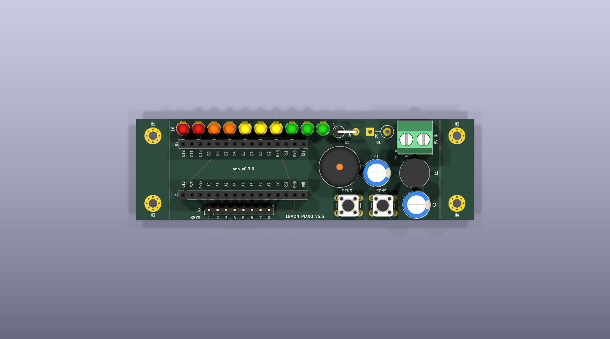
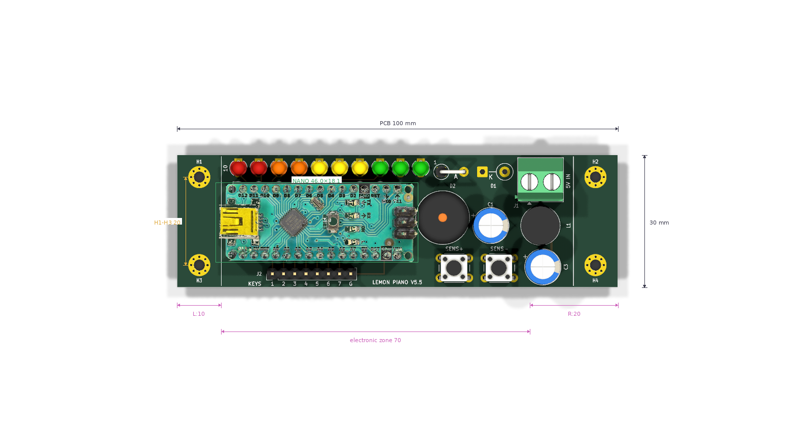
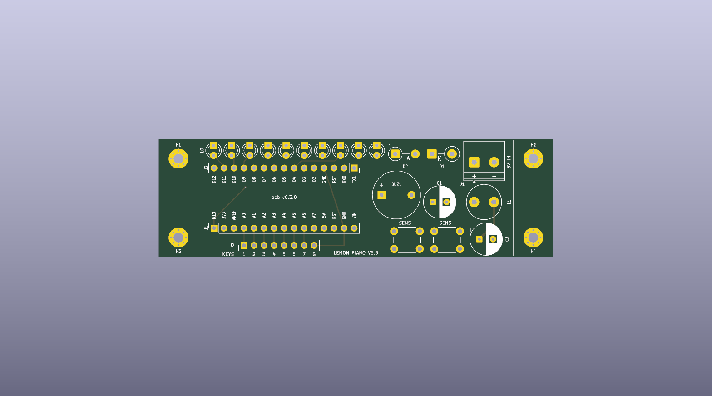
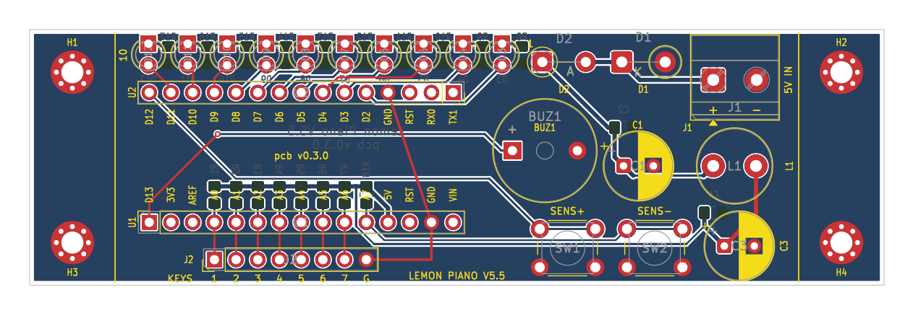
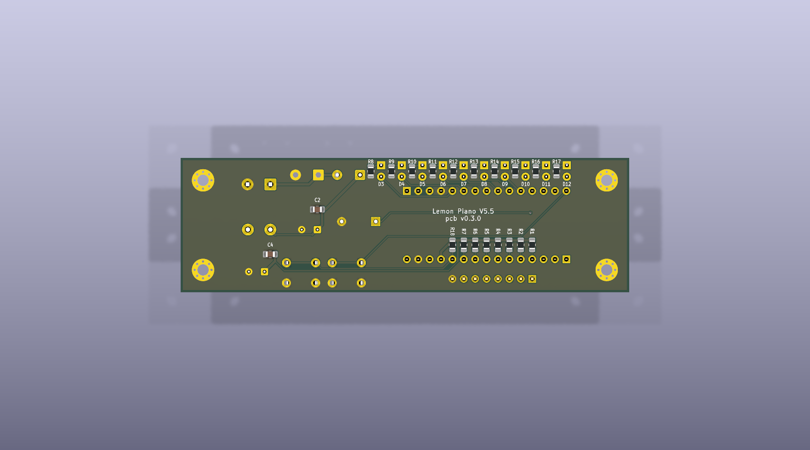

# Lemon Piano V5.5 Board

A fabricable 2-layer KiCad-9 PCB that replaces the
[V5.5](../versions/v5.5-power-filter) breadboard build of this repo — same circuit, same firmware pinout, nothing invented. Seven lemon
touch keys, a ten-LED progress bar, two sensitivity buttons, a passive
buzzer, and the V5.5 **power-entry filter** (TVS + Schottky + CLC pi) that
keeps mains transients from playing phantom notes on a 15–20 mV touch
margin.

| | |
|---|---|
| Realistic (3D bodies) |  |
| Photo overlay (real Nano photo, dimensioned) |  |
| Normal (bare copper/silk) |  |
| DIM plot (front) |  |
| Bottom (realistic) |  |

Per version the pipeline archives four styles per side under `renders/`
(`<ver>-{normal,dim,realistic,overlay}-{top,bottom}.png`), all produced
by the hosted pcb-designer API; the overlay composites the real Arduino
Nano photo (Wikimedia Commons, CC BY 2.0) that the pipeline uploads from
`overlays/component-images/` + `overlays/modules.yaml`. Every socket pin
carries its function on silk (MT1-style legends) and every component its
reference, both layers.

## At a glance

| Item | Value |
|---|---|
| Outline | 100 × 30 mm, 2-layer FR4, MT1 coordinate frame (x 90–190, y 100–130) |
| MCU | Arduino Nano (ATmega328P), **socketed** — 2×15-pin 2.54 mm rows, mini-USB faces the WEST edge (flash access; USB 5 V stays behind the 1N5817) |
| Keys | 7 lemon lines (A0–A6, 220 Ω pull-ups on B.Cu) + GND clip → labelled 1×8 header, SOUTH edge (`1 2 3 4 5 6 7 G`) |
| Display | 10 × 3 mm LEDs (D2–D11): 3 green → 3 yellow → 2 orange → 2 red, NORTH edge, ascending east→west (ADR-015/021), 220 Ω each on B.Cu |
| Controls | SENS+ (D12) / SENS− (A7 + 10 k pull-up) buttons, SOUTH-east |
| Sound | passive buzzer on D13 |
| Power | `5V IN` screw terminal → P6KE6.8A TVS → 1N5817 → 470 µF‖100 nF → 100 µH → 470 µF‖100 nF → +5 V rail (≈4.7 V, fc ≈ 730 Hz) |
| GND | full B.Cu zone, solid connect on every GND pad, auto island-healing |
| Mounting | 4 × M2 (Ø2.5 drill / Ø5.0 pad+vias): two per short edge at x=95/185, y=105/125 — mirror-symmetric about x=140 and y=115 |
| Status (v0.3.0) | DRC **0/0/0** · ERC 0/0 · verify_placement / verify_holes / geometry_gate ALL PASS |
| Release | [`releases/v0.3.0/lemon-piano-v0.3.0-fab.zip`](releases/v0.3.0/) — gerbers, drill, BOM, positions |

**Implementing a change?** Paste [docs/AGENT_PROMPT.md](docs/AGENT_PROMPT.md)
into a fresh agent session together with the change request — it encodes
the full workflow, gates and pitfalls learned across v0.0.1→v0.3.0.

Netlist ground truth: [docs/NETLIST.md](docs/NETLIST.md) ·
decisions: [docs/DECISIONS.md](docs/DECISIONS.md) ·
state + iteration log: [docs/DESIGN_STATE.md](docs/DESIGN_STATE.md) ·
render history: [renders/INDEX.md](renders/INDEX.md)

## How to regenerate

Everything is generated from [`lemon-piano.yaml`](lemon-piano.yaml) +
[`docs/NETLIST.md`](docs/NETLIST.md). The pcb-designer toolkit lives in the
sibling repo `../eda-pcb-designer` (its Docker image + hosted API); the
cloud service does every
pipeline operation that has an endpoint, the Docker image handles the two
generative steps (board/schematic instantiation) and the width/zone
post-pass:

```bash
# one full iteration: build → /place → /route → post → /drc → /render → gates
./pcb/tools/cloud_pipeline.sh v0.3.0

# release (adds cloud /fab, writes releases/<ver>/):
./pcb/tools/cloud_pipeline.sh v0.3.0 --fab

# render variants (any style, hosted API):
URL=https://pcb-designer.scv.multitecua.com
curl -F pcb=@pcb/kicad/lemon-piano.kicad_pcb "$URL/render?side=both&style=realistic" -o r.zip
curl -F pcb=@pcb/kicad/lemon-piano.kicad_pcb -F modules=@pcb/overlays/modules.yaml \
     -F images=@pcb/overlays/component-images/arduino-nano.png \
     "$URL/render?side=top&style=overlay&calibration=green_bbox" -o overlay.png

# individual gates:
python3 pcb/tools/verify_placement.py   # anti-mirror/pin-swap
python3 pcb/tools/verify_holes.py       # anchor holes vs GT
python3 pcb/tools/geometry_gate.py      # outline/symmetry/copper
```

All builders are idempotent — re-running produces byte-identical files
(LESSONS_LEARNED §7). The KiCad artefacts live in `kicad/`; every
iteration's DRC report and renders are archived under `validation/` and
`renders/` with their version tag.

## Assembly notes

- Small passives are 0805 HandSolder; R1–R7/R18 and R8–R17 + C2/C4 mount
  on the **bottom** (refs on F.Fab, values in the BOM/pos files).
- Feed `5V IN` from a USB wall charger or bench supply — never the PC
  that flashes the Nano (see the V5.5 powering rules); loop the input
  lead 3–4 turns through a clip-on ferrite for the common-mode path.
- The GND terminal position (`G`, west end of the keys header) is the
  player's hand-held clip line.
