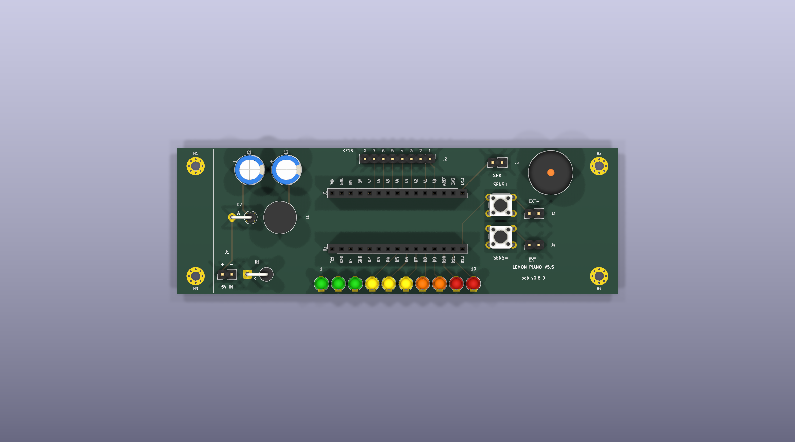
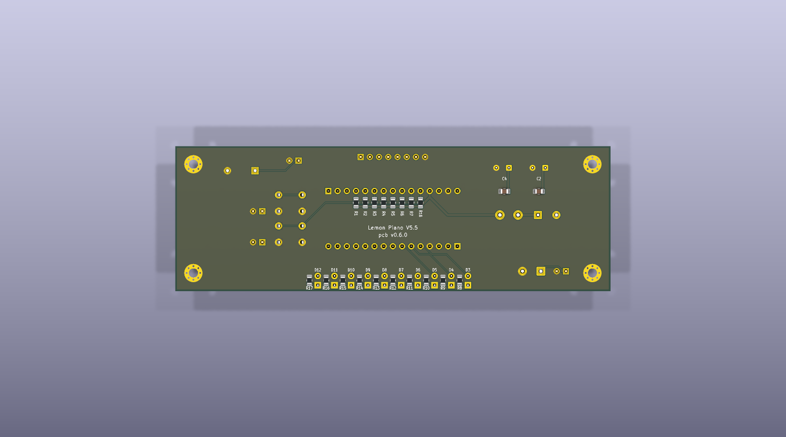

# Lemon Piano V5.5 Board

A fabricable 2-layer KiCad-9 PCB that replaces the
[V5.5](../versions/v5.5-power-filter) breadboard build of this repo — same circuit, same firmware pinout, nothing invented. Seven lemon
touch keys, a ten-LED progress bar, two sensitivity buttons, a passive
buzzer, and the V5.5 **power-entry filter** (TVS + Schottky + CLC pi) that
keeps mains transients from playing phantom notes on a 15–20 mV touch
margin.

| | |
|---|---|
| Realistic (3D bodies) |  |
| Photo overlay (real Nano photo, dimensioned) |  |
| Normal (bare copper/silk) |  |
| DIM plot (front) |  |
| Bottom (realistic) |  |

Per version the pipeline archives four styles per side under `renders/`
(`<ver>-{normal,dim,realistic,overlay}-{top,bottom}.png`), all produced
by the hosted pcb-designer API; the overlay composites the real Arduino
Nano photo (Wikimedia Commons, CC BY 2.0) that the pipeline uploads from
`overlays/component-images/` + `overlays/modules.yaml`. Every socket pin
carries its function on silk (MT1-style legends) and every component its
reference, both layers.

## At a glance

| Item | Value |
|---|---|
| Outline | **120 × 40 mm**, 2-layer FR4, MT1 coordinate frame (x 90–210, y 100–140, centre 150/120) |
| MCU | Arduino Nano (ATmega328P), **socketed, centred, and flipped so the mini-USB faces EAST** — 2×15-pin 2.54 mm rows (pin field x 132.22–167.78, rows y 112.38/127.62). The flip puts the analog column on the north row and the digital column on the south row, which is what allows keys-north / LEDs-south (ADR-029). USB 5 V still stays behind the 1N5817 |
| Keys | 7 lemon lines (A0–A6, 220 Ω pull-ups on B.Cu) + GND clip → labelled 1×8 header **centred** on the **NORTH** edge, pin 1 = KEY1 at the east so silk reads `KEYS G 7 6 5 4 3 2 1` west→east (pin centre exactly x=150) |
| Display | 10 × 3 mm LEDs (D2–D11): 3 green → 3 yellow → 2 orange → 2 red, **SOUTH** edge, **centred on x=150**, ascending west→east (ADR-029/021), 220 Ω each on B.Cu |
| Controls | SENS+ (D12) / SENS− (A7 + 10 k pull-up) buttons in the EAST block, the **pair centred on the y=120 mid-line**, each with a **parallel 2-pin header** (J3/J4) for an external panel button (ADR-026) |
| Sound | passive buzzer on D13, NE corner — ~20 mm from its pin now that the flip moved D13 to the east end. **`SPK`** (J5) is a 2-pin aux output wired in parallel with it (ADR-034) |
| Power | `5V IN` **2-pin header** → P6KE6.8A TVS → 1N5817 → 470 µF‖100 nF → 100 µH → 470 µF‖100 nF → +5 V rail (≈4.7 V, fc ≈ 730 Hz). Whole filter in the WEST block as a compact 3-row group with **C1 ‖ C3 adjacent** (ADR-025/031) |
| GND | full B.Cu zone, solid connect on every GND pad, auto island-healing |
| Mounting | 4 × M2 (Ø2.5 drill / Ø5.0 pad+vias): two per short edge at x=95/205, y=105/135 — mirror-symmetric about x=150 and y=120 |
| Status (v0.6.0) | DRC **0/0/0** · ERC 0/0 · verify_placement / verify_holes / geometry_gate ALL PASS |
| Release | [`releases/v0.6.0/lemon-piano-v0.6.0-fab.zip`](releases/v0.6.0/) — gerbers, drill, BOM, positions |

**Implementing a change?** Paste [docs/AGENT_PROMPT.md](docs/AGENT_PROMPT.md)
into a fresh agent session together with the change request — it encodes
the full workflow, gates and pitfalls learned across v0.0.1→v0.6.0.

Netlist ground truth: [docs/NETLIST.md](docs/NETLIST.md) ·
decisions: [docs/DECISIONS.md](docs/DECISIONS.md) ·
state + iteration log: [docs/DESIGN_STATE.md](docs/DESIGN_STATE.md) ·
render history: [renders/INDEX.md](renders/INDEX.md)

## How to regenerate

Everything is generated from [`lemon-piano.yaml`](lemon-piano.yaml) +
[`docs/NETLIST.md`](docs/NETLIST.md). The pcb-designer toolkit lives in the
sibling repo `../eda-pcb-designer` (its Docker image + hosted API); the
cloud service does every
pipeline operation that has an endpoint, the Docker image handles the two
generative steps (board/schematic instantiation) and the width/zone
post-pass:

```bash
# one full iteration: build → /place → /route → post → /drc → /render → gates
./pcb/tools/cloud_pipeline.sh v0.6.0

# release (adds cloud /fab, writes releases/<ver>/):
./pcb/tools/cloud_pipeline.sh v0.6.0 --fab

# render variants (any style, hosted API):
URL=https://pcb-designer.scv.multitecua.com
curl -F pcb=@pcb/kicad/lemon-piano.kicad_pcb "$URL/render?side=both&style=realistic" -o r.zip
curl -F pcb=@pcb/kicad/lemon-piano.kicad_pcb -F modules=@pcb/overlays/modules.yaml \
     -F images=@pcb/overlays/component-images/arduino-nano.png \
     "$URL/render?side=top&style=overlay&calibration=green_bbox" -o overlay.png

# individual gates:
python3 pcb/tools/verify_placement.py   # anti-mirror/pin-swap
python3 pcb/tools/verify_holes.py       # anchor holes vs GT
python3 pcb/tools/geometry_gate.py      # outline/symmetry/copper
```

All builders are idempotent — re-running produces byte-identical files
(LESSONS_LEARNED §7). The KiCad artefacts live in `kicad/`; every
iteration's DRC report and renders are archived under `validation/` and
`renders/` with their version tag.

## Look at the board in 3D

Every pipeline run writes a rotatable model to `pcb/3d/`, **committed to the
repo** so you can clone and look at the board with no KiCad toolchain at all:

| File | For |
|---|---|
| `lemon-piano-<ver>.glb` | looking at it: browsers, `f3d`, Windows/macOS 3D viewers |
| `lemon-piano-<ver>.step` | CAD — FreeCAD / Fusion, enclosure fit checks |

**In VS Code — one click.** This repo ships a
[`.vscode/extensions.json`](../.vscode/extensions.json) recommending
[`thingraph.cad-viewer`](https://marketplace.visualstudio.com/items?itemName=thingraph.cad-viewer),
so VS Code offers to install it the first time you open the project
(Extensions view → *Recommended*). Or explicitly:

```bash
code --install-extension thingraph.cad-viewer
```

Then **double-click `pcb/3d/lemon-piano-v0.6.0.glb`** — or the `.step` — and it
opens in a tab you can drag to rotate. It is the only extension that handles
both formats the pipeline emits, and it bundles `occt-import-js.wasm`
(OpenCascade), so STEP is a real geometry kernel. Free, read-only, ~24 MB.

> Don't reach for **glTF Tools** (`cesium.gltf-vscode`) instead just because it
> has 100× the installs: it validates and converts glTF/GLB but registers no
> viewer for `.glb`, so you'd have to import to `.gltf` first to see anything.

**Web, nothing to install** — open <https://3dviewer.net> and drag the `.glb`
in. Drag rotates, scroll zooms. It renders in your browser, so the file is not
uploaded to a server.

**Local, lightweight** — [f3d](https://f3d.app):

```bash
sudo apt install f3d
f3d pcb/3d/lemon-piano-v0.6.0.glb
```

Note these are binaries in git (~16 MB per version, and git history keeps
every past one forever — deleting them later does not shrink the repo). That
is a deliberate trade: the files are the whole point of having them, and a
handful of releases is well inside GitHub's limits. If it ever gets heavy, the
standard fix is Git LFS, not deletion. Only `pcb/3d/models/` stays untracked —
that is the fetched cache of verbatim third-party KiCad body files, which the
script re-downloads in seconds.

They will **not** preview on github.com: GitHub renders only `.stl` inline and
only up to 10 MB, and this board's STL is 34 MB. Download the `.glb` and open
it with one of the viewers above.

Generated by the cloud `/export3d` endpoint during
`cloud_pipeline.sh`, because the service image ships the `kicad-packages3d`
body library that the slim local Docker image deliberately omits. To make them
without the pipeline (fetches just the ~15 bodies this board needs, ~1.4 MB,
cached in `pcb/3d/models/`):

```bash
./pcb/tools/export_3d.sh
```

Note the two orange LEDs (D9/D10) show **red** in locally generated files —
no orange body exists in the upstream library, so the exporter falls back to
the base one and says so. The cloud-generated files have the real orange.

**KiCad's own viewer** is the richest option (layer toggles, cross-sections,
raytracing) but needs KiCad 9 installed. Ubuntu's repos only carry KiCad 7,
which cannot open this v9 board — use the PPA, and stay on the 9.x series so
the file format keeps matching the pipeline:

```bash
sudo add-apt-repository ppa:kicad/kicad-9.0-releases
sudo apt update && sudo apt install --install-recommends kicad kicad-packages3d
```

Then open `pcb/kicad/lemon-piano.kicad_pcb` and press **Alt+3**.

## Assembly notes

- Small passives are 0805 HandSolder; R1–R7/R18 and R8–R17 + C2/C4 mount
  on the **bottom** (refs on F.Fab, values in the BOM/pos files).
- Feed `5V IN` (J1, `+` west / `−` east) from a USB wall charger or bench
  supply — never the PC that flashes the Nano (see the V5.5 powering
  rules); loop the input lead 3–4 turns through a clip-on ferrite for the
  common-mode path. J1 is a bare header, so strain-relieve the input lead
  (zip-tie through a mounting hole) if the piano gets carried around.
- The GND terminal position (`G`, **west** end of the keys header, next to
  key 7) is the player's hand-held clip line.
- `EXT+` (J3) and `EXT−` (J4) are wired in parallel with the SENS+/SENS−
  buttons. Leave them empty for on-board-only use, or wire a panel button
  across each pair — no jumper to move, and both buttons keep working.
- **`SPK` (J5) is the aux sound output**, in parallel with the buzzer: pin 1
  is the raw D13 drive, pin 2 is GND. The on-board buzzer keeps sounding
  either way. **Mind the load** — D13 drives a *passive piezo* directly, so
  J5 suits another piezo element or an **amplified** speaker module
  (PAM8403 / LM386 board / powered PC speakers, all high-impedance inputs).
  A bare 4–8 Ω speaker would draw ~600 mA against the ATmega328P's 40 mA
  absolute maximum per pin and **would damage D13** — drive one only through
  an amplifier (ADR-034).
- **Flashing needs the Nano out of its socket.** The mini-USB faces EAST and
  no cable clearance is reserved (ADR-030, deliberate): the connector shell
  reaches x≈173.3 and the SENS+ button starts at 173.48. Flash the module
  before seating it, or lift it out. Grip it by the west end (the whole west
  side of the socket field is clear) or from above.
