# Renders gallery — renders

> Auto-generated by `pcb-designer gallery renders`. Edit the YAML config or re-run the renderer to update — do NOT hand-edit this file.

Versions catalogued: **8**

## v0.2.1 — realistic

| top | bottom |
|---|---|
|  | 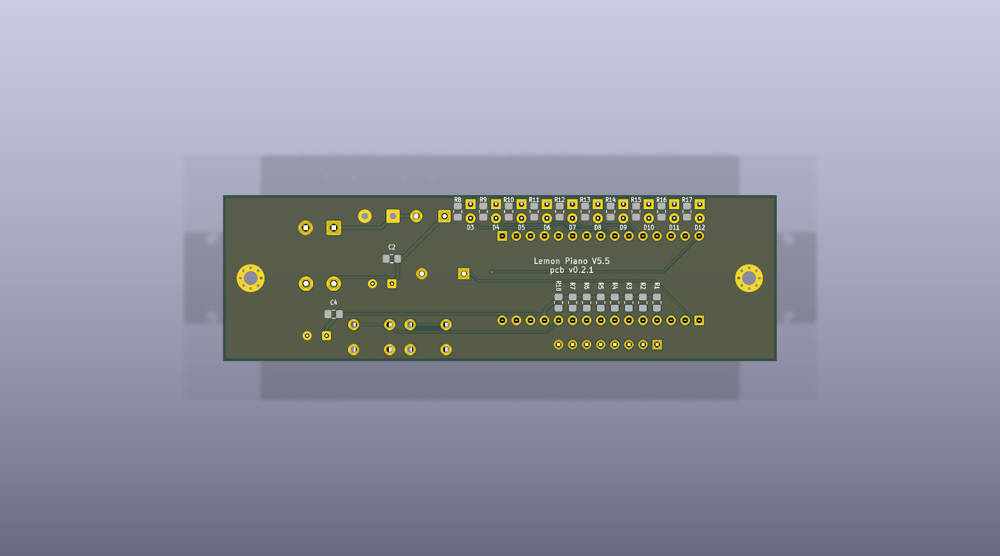 |

## v0.2.1 — overlay

| top | bottom |
|---|---|
|  | 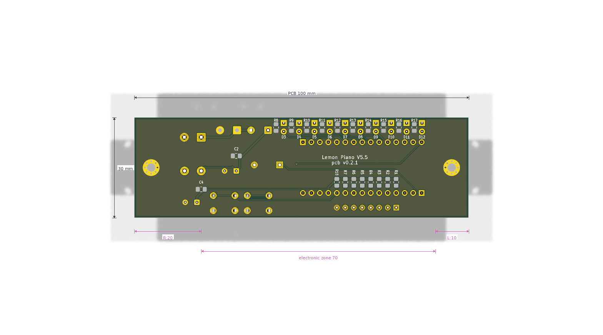 |

## v0.2.1 — normal

| top | bottom |
|---|---|
| 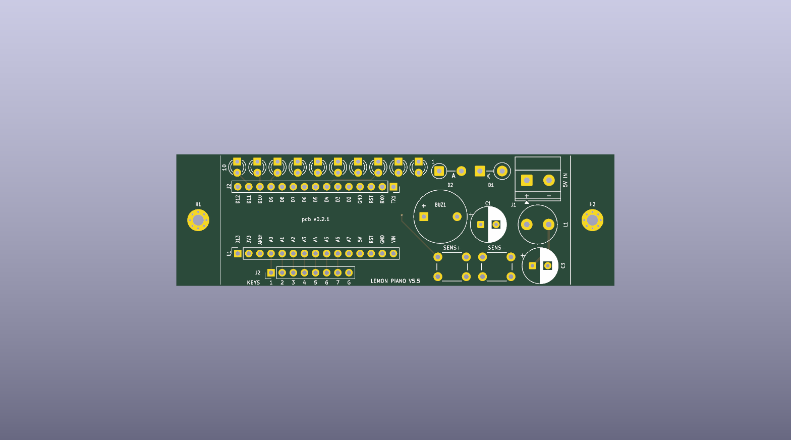 | 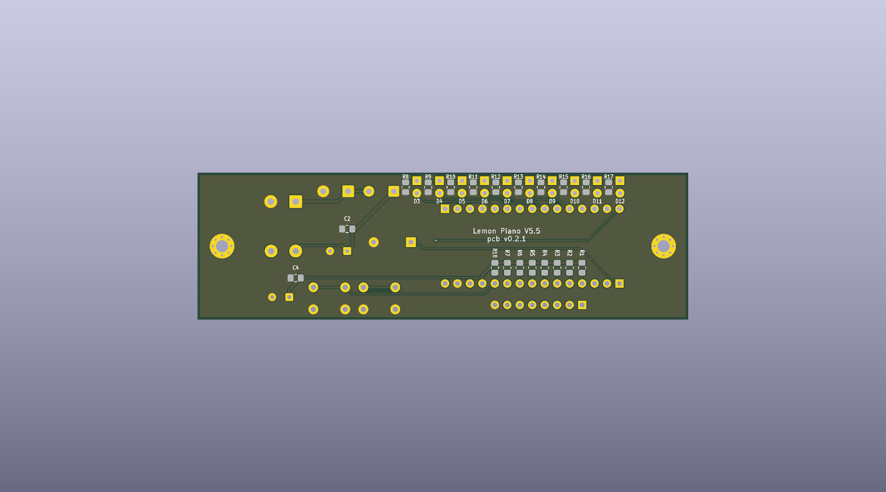 |

## v0.2.1 — dim

| top | bottom |
|---|---|
| 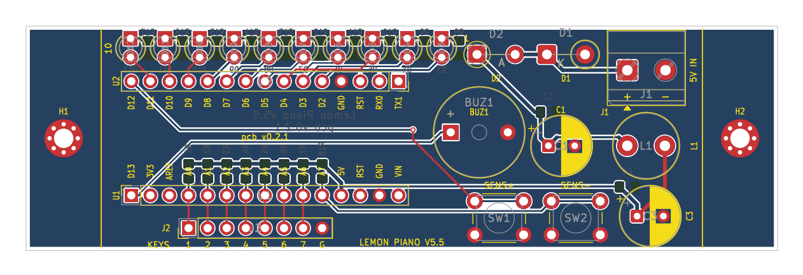 | 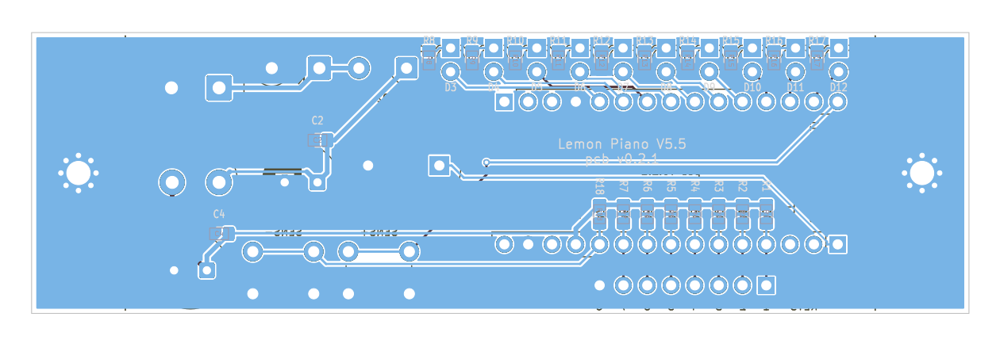 |

## v0.2.0 — realistic

| top | bottom |
|---|---|
| 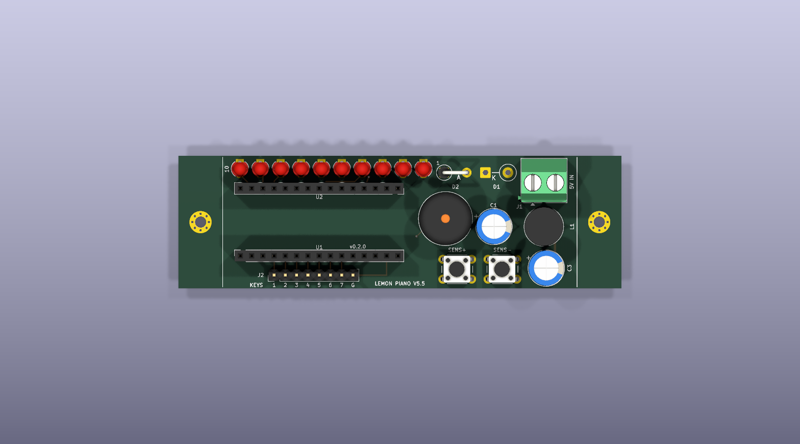 | 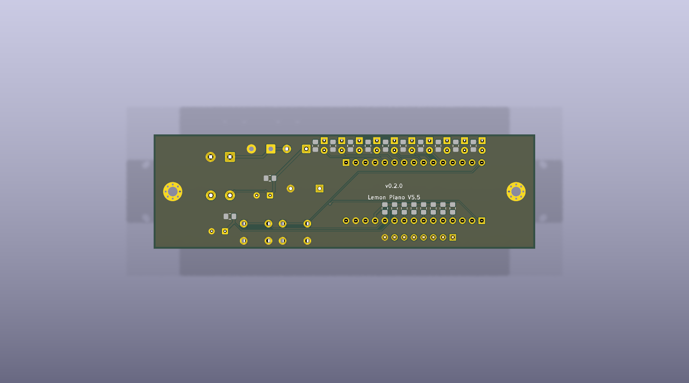 |

## v0.2.0 — overlay

| top | bottom |
|---|---|
| 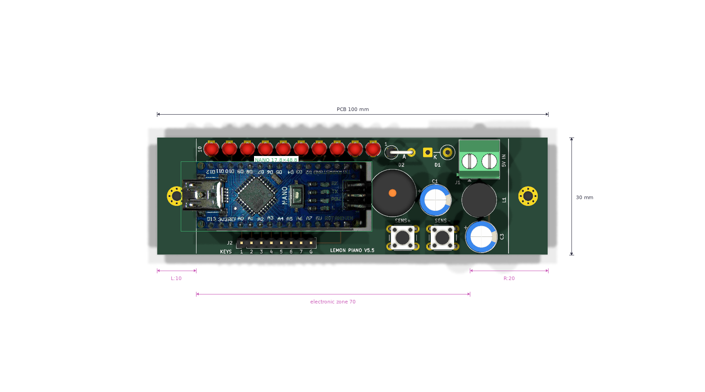 | 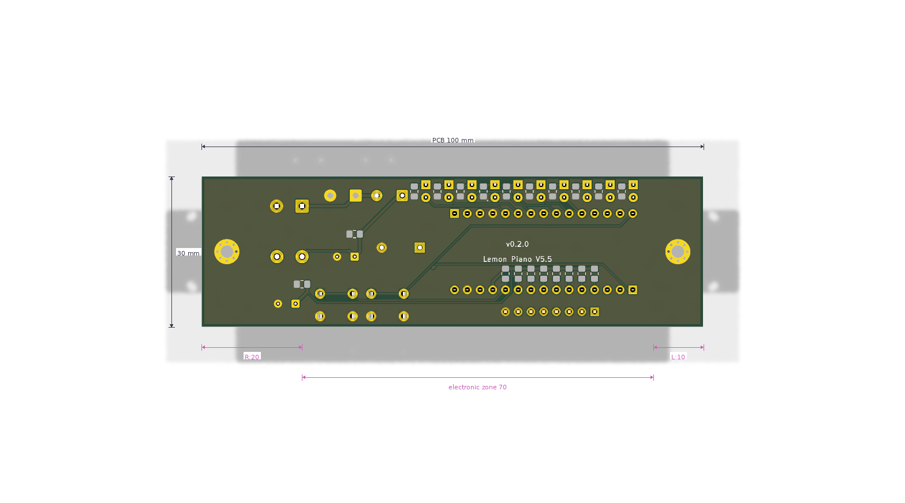 |

## v0.2.0 — normal

| top | bottom |
|---|---|
| 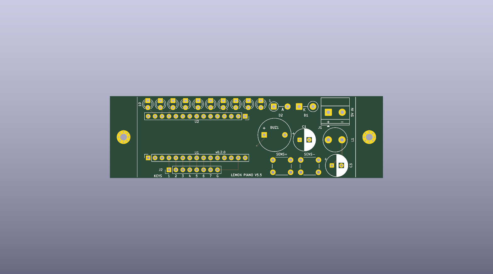 | 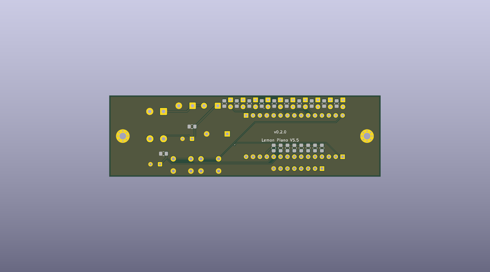 |

## v0.2.0 — dim

| top | bottom |
|---|---|
| 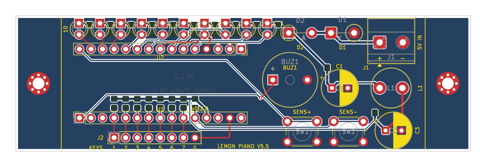 | 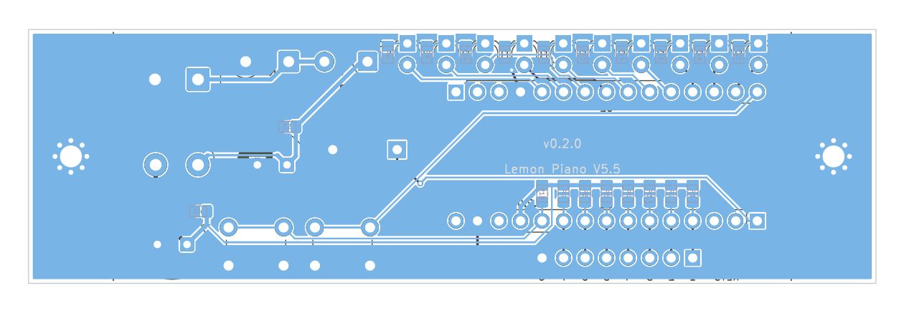 |
