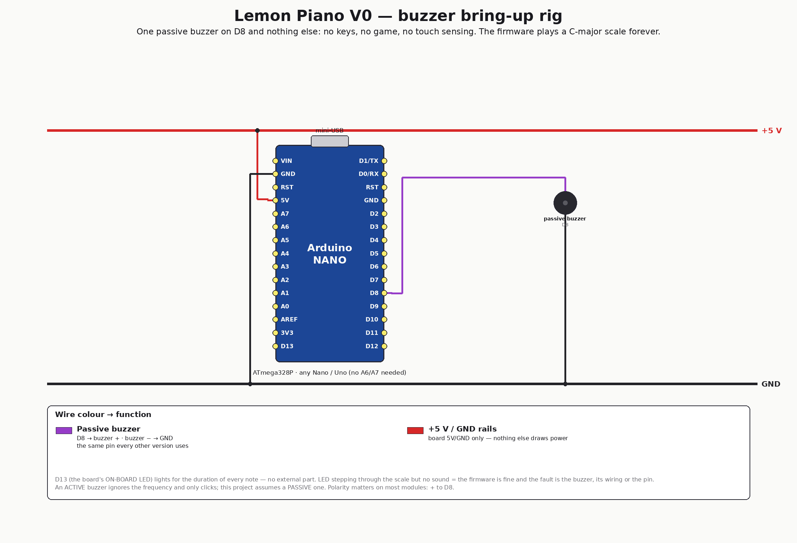

# V0 — buzzer bring-up rig (2026)

The smallest board in the project: **an ATmega328 and one passive buzzer on D8.**
No keys, no LEDs beyond the on-board one, no game, no touch sensing. The firmware
plays a C-major scale up and down, forever, with real silence between notes.

If the scale sounds right here, the buzzer and its wiring are fine and any problem
is upstream (sensing, timing, the game). If it sounds wrong here, you have removed
every other suspect.

> **Not a historical board.** V1–V5 are the real lineage; V0 was created on
> 2026-07-26 as a diagnostic. It is numbered 0 because its board is a *subset* of
> every other version — take any board in this repo, remove everything except the
> buzzer, and you have V0.

<div align="center">

</div>

## What you hear and see

```
C4  D4  E4  F4  G4  A4  B4  C5      ascending   (262 → 523 Hz)
C5  B4  A4  G4  F4  E4  D4          descending, back to the start
… 700 ms pause, then again, forever
```

- Each note sounds for **300 ms**, followed by **80 ms of real silence** — so a
  dropout, a stuck note or a wrong pitch is obvious by ear.
- The **on-board LED (D13)** lights for the duration of every note. This is the
  key diagnostic: *LED stepping through the scale but no sound* ⇒ the firmware is
  running fine and the fault is the buzzer, its wiring, or the pin.
- Every note is printed at **9600 baud**: `note 3/14 - 330 Hz`.

## Flash it

```bash
cd firmware
pio run -t upload                            # Nano, old bootloader (57600) — default
pio run -e nanoatmega328new -t upload        # if that times out ("programmer is not responding")
pio run -e uno -t upload                     # Uno (V0 needs no A6/A7)
pio device monitor                           # 9600 baud — watch the notes go by
```

### Testing the *other* playback path

Every version drives the buzzer two ways, and they can fail independently:

| Build | Path | Used in the real game for |
|---|---|---|
| `pio run -t upload` (default) | `tone()` / `noTone()` — AVR hardware timer | key notes, the "wrong" tone |
| `pio run -e nanoatmega328-buzz -t upload` | bit-banged `buzz()` — `digitalWrite` + `delayMicroseconds` | the Mario victory / death themes |

Flash both. If the scale is clean on one and wrong on the other, you have located
the fault precisely; if both are wrong, it is the hardware.

## Wiring (that's all of it)

```
 D8  ──────────── buzzer (+)
 GND ──────────── buzzer (−)
```

Nothing else — no resistor needed. ⚠️ Two classic traps: a **passive** buzzer is
required (an *active* one ignores the frequency and just clicks at its own pitch),
and most buzzer modules are **polarised** (+ to D8). Details:
[HARDWARE.md](HARDWARE.md).

## Emulation — ✅ verify green

The reference recording, in the browser, on the same firmware:

```bash
PIPE=../../../velxio-multi-board-emulator/harness/.venv/bin/velxio-pipeline
$PIPE stack up        # then import emulation/lemon-piano.vlx at http://localhost:3080/editor
$PIPE run --mode verify --spec emulation/lemon-piano.yaml --out emulation/runs
```

Play it in the browser and compare it with your board by ear — that is the fastest
way to judge "it doesn't sound as usual". `verify` asserts the banner, that the
buzzer pin toggles through the scale (7 496 edges) and that the scale **completes
and repeats** (a note that never ends is the classic browser failure). Last run:
**pass** (2026-07-26). Browser buzzer is on **D11**, not D8 — see
[emulation/README.md](emulation/README.md).

## Files

| Path | What |
|---|---|
| [firmware/src/main.cpp](firmware/src/main.cpp) | the whole thing: scale table, both playback paths, Velxio shim |
| [emulation/lemon-piano.yaml](emulation/lemon-piano.yaml) | circuit spec (one buzzer) |
| [emulation/lemon-piano.vlx](emulation/lemon-piano.vlx) | generated project — import into Velxio and Run |
| [HARDWARE.md](HARDWARE.md) | pin map, BOM, buzzer troubleshooting |
| [images/wiring-v0.png](images/wiring-v0.png) | wirewright-rendered wiring |

**Next revision:** [V1 — banana piano](../v1-banana-piano/) adds the 7 fruit touch
keys (and the HC-SR04 the tutorial rig carried) around this same buzzer.
