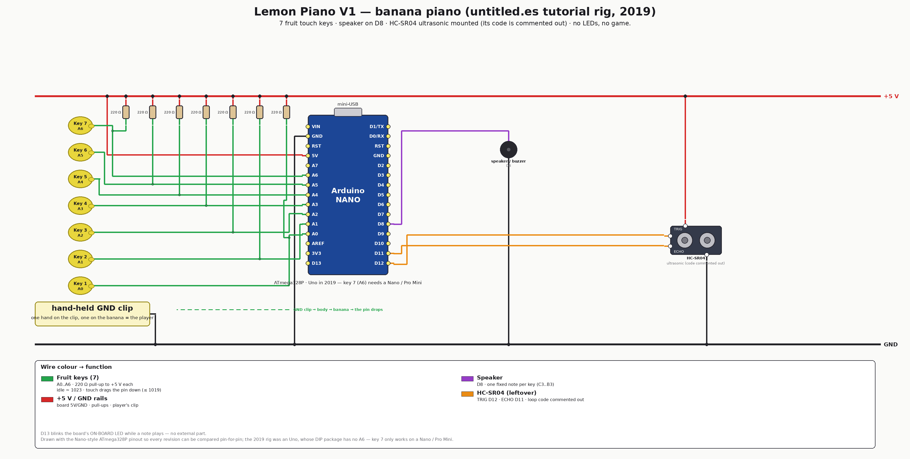

# V1 — banana piano 🍌 (2019)

The board this whole project grew from: the
[untitled.es](http://untitled.es) *fruit piano* tutorial rig. Seven pieces of
fruit are touch keys on A0–A6; touching one plays a fixed note on a speaker.
No LEDs, no game, no relays — an instrument, not a puzzle.

**Hardware delta:** the 2019 origin — historically the first board in this story
(the [V0 buzzer rig](../v0-buzzer/) is a 2026 diagnostic that isolates a *subset*
of it). 7 fruit keys with 220 Ω pull-ups, a speaker on D8, and an **HC-SR04
ultrasonic module** left over from the tutorial's other demo (mounted and wired,
its driving code commented out in the sketch).

<div align="center">

</div>

## How it plays

Hold the **GND** clip in one hand, touch a fruit with the other: your body drags
that analog pin down from its idle ~1023 and the sketch plays the key's note.
One fixed note per key, 150 ms, no sequence to guess.

| Key | 1 | 2 | 3 | 4 | 5 | 6 | 7 |
|---|---|---|---|---|---|---|---|
| Pin | A0 | A1 | A2 | A3 | A4 | A5 | A6 |
| Note | C3 | D3 | E3 | F3 | G3 | A3 | B3 |

Detection is `((analogRead(n) + analogRead(n)) / 2) <= 1019` — a 2-sample
average and a threshold only 4 counts below idle, because the body's resistance
is enormous next to the 220 Ω pull-up. See
[../../docs/HARDWARE.md](../../docs/HARDWARE.md) for the sensing physics and why
V4 inverted it.

## Firmware

Arduino IDE sketch, kept in its IDE-compatible folder and also driven by
PlatformIO (`src_dir = banana-piano`):

```bash
cd firmware
pio run                 # nanoatmega328 (default) — the env with a working key 7
pio run -e uno          # the historical board; A6 (key 7) does not exist on it
pio run -t upload
```

Comments and identifiers were translated to English during the 2026-07-12
rescue; the pristine Spanish original is in git history (commit
`rescue: original 2019 lemon piano files`). The commented-out HC-SR04 block is
preserved verbatim — it is the reason the module is on the diagram.

## Emulation

None. The 2019 sketches predate the `VELXIO_EMULATION` input shim, and a
faithful browser build would need three changes to historical code (buzzer moved
to a PWM pin with `OCR2A` cleared, key 7 off A6, pull-up buttons instead of the
divider). Rather than rewrite the oldest sketch in the repo, this board is
documented and buildable only — see [emulation/README.md](emulation/README.md)
for exactly what it would take, and `TODO.md` for the open decision.

## Files

| Path | What |
|---|---|
| [firmware/banana-piano/banana-piano.ino](firmware/banana-piano/banana-piano.ino) | the sketch (+ `pitches.h`) |
| [HARDWARE.md](HARDWARE.md) | pin map, BOM, wiring detail |
| [images/wiring-v1.png](images/wiring-v1.png) | wirewright-rendered wiring |
| [images/banana-piano-original.png](images/banana-piano-original.png) | the tutorial's own breadboard picture (Uno + speaker) |

**Next revision:** [V2 — keyboard test](../v2-keyboard-test/) strips the
ultrasonic module off the rig.
