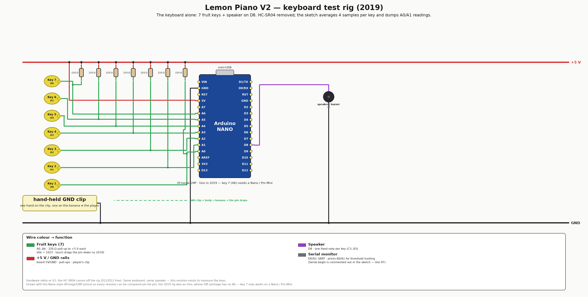

# V2 — keyboard test rig (2019)

The instrument reduced to the part that mattered: **just the keyboard and the
speaker**. This is the board used to find out what the fruit keys actually read,
right before the game logic arrived in V3.

**Hardware delta vs [V1](../v1-banana-piano/):** the HC-SR04 ultrasonic module
comes **off** the rig (D11/D12 free again). Nothing else changes — same 7 keys,
same 220 Ω pull-ups, same speaker on D8.

<div align="center">

</div>

## How it plays

Same as V1 — hold the GND clip, touch a fruit, hear its note — with two firmware
differences that betray what the board was *for*:

- **4-sample averaging** per key (`(analogRead(n)×4)/4`) instead of V1's 2, to
  fight mains noise. Key 7 still uses 2 samples (a leftover).
- **Serial dumps** of A0 and A1, four readings each per loop, so you can watch
  the idle level and pick a threshold.

| Key | 1 | 2 | 3 | 4 | 5 | 6 | 7 |
|---|---|---|---|---|---|---|---|
| Pin | A0 | A1 | A2 | A3 | A4 | A5 | A6 |
| Note | C3 | D3 | E3 | F3 | G3 | A3 | B3 |

> **Quirk worth knowing:** `Serial.begin(9600)` is commented out (line 97) while
> the `Serial.print` calls are live — as shipped, the readings go nowhere.
> Uncomment that line before using the monitor. Left as-is on purpose: this is
> the 2019 sketch, and the fix belongs to whoever revives the rig.

## Firmware

```bash
cd firmware
pio run                 # nanoatmega328 (default) — the env with a working key 7
pio run -e uno          # the historical board; A6 (key 7) does not exist on it
pio run -t upload
pio device monitor       # 9600 baud — after uncommenting Serial.begin
```

## Emulation

None — same reason as V1 (buzzer pin, key 7 on A6, and the divider), see
[emulation/README.md](emulation/README.md).

## Files

| Path | What |
|---|---|
| [firmware/keyboard-test/keyboard-test.ino](firmware/keyboard-test/keyboard-test.ino) | the sketch (note table inlined) |
| [HARDWARE.md](HARDWARE.md) | pin map, BOM, wiring detail |
| [images/wiring-v2.png](images/wiring-v2.png) | wirewright-rendered wiring |

**Next revision:** [V3 — game prototype](../v3-game-prototype/) adds the two
feedback LEDs, a game-select button and the first relay.
