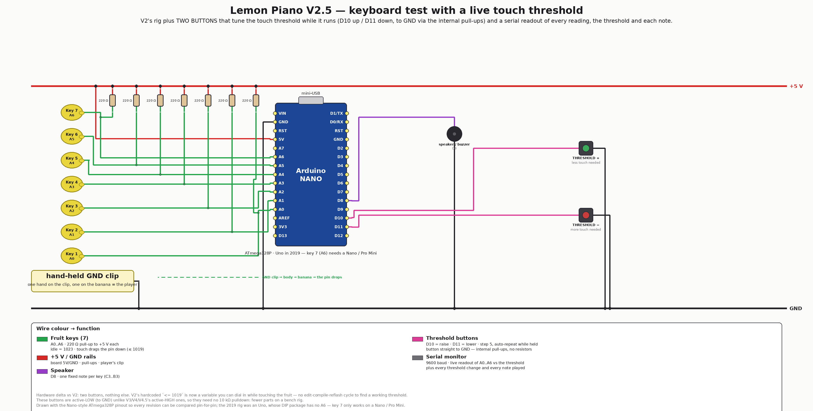

# V2.5 — keyboard test with a live touch threshold (2026)

[V2](../v2-keyboard-test/) is the 2019 keyboard test rig, and its touch detection
hangs on one hardcoded number: the famous `<= 1019`. Finding a working value meant
edit → compile → reflash, over and over, for a number that depends on the fruit,
the power supply, the mains outlet and where your feet are.

V2.5 makes that number **a variable you can dial while you play**, and turns on the
serial monitor V2 never had.

**Hardware delta vs [V2](../v2-keyboard-test/):** two buttons, nothing else —
**THRESHOLD + on D10** and **THRESHOLD − on D11**. Both wired **straight to GND**
using the AVR's internal pull-ups, so they need **no external resistors** (a
deliberate difference from V3/V4/V4.5, whose active-HIGH buttons each need a
10 kΩ pulldown — this is a bench instrument, so fewer parts wins).

<div align="center">

</div>

## What it does

- **The threshold is live.** Each press steps it by 5, and holding a button
  **auto-repeats** (400 ms to start, then every 120 ms) so you can sweep the whole
  0–1023 range without 200 presses. Limits are clamped and reported.
- **The serial monitor is the instrument** (9600 baud). Twice a second it prints
  every channel's 4-sample average next to the threshold, with a `*` marking each
  channel currently counted as touched:

```
Lemon Piano V2.5 - keyboard test, live threshold
buzzer pin: D8
threshold + : D10   threshold - : D11
touch detected when the average is BELOW the threshold (2019 wiring)
threshold=1019
---- A0   A1   A2   A3   A4   A5   A6  | thr  (live readout)
      1023  1023  1023  1023  1023  1023  1023 | 1019
KEY 1 C3  reading=0  threshold=1019
>>> threshold=1014  (-5)
```

- **One note per fresh touch.** V2 re-fired every loop while a key was held, which
  machine-guns the buzzer and makes the readout unreadable; here each touch is
  edge-triggered. Notes are V2's: C3 D3 E3 F3 G3 A3 B3, 150 ms.

### How to use it to find a threshold

Watch the live readout while you touch one lemon, and dial the buttons until only
that channel is starred. If no value marks exactly one channel, the problem is the
front-end, not the number — see
[../v5-led-bar/HARDWARE.md](../v5-led-bar/HARDWARE.md#️-the-pull-downs-are-not-optional-measured-2026-07-27)
for the measurements that show why, and fit the pull-downs.

> ⚠️ **Polarity.** This keeps V2's 2019 sensing: pins pulled **up** to 5 V through
> 220 Ω, player holding a **GND** clip, so a touch drags the reading **down** and
> "touched" means `average <= threshold`. If your board is wired the 2026 way
> (clip on +5 V, 220 Ω in series, pins floating low and **rising** on touch), that
> comparison is backwards and *no* threshold works — flip `TOUCH_WHEN_BELOW` to
> `false` at the top of [firmware/src/main.cpp](firmware/src/main.cpp) and the same
> buttons tune the 2026 wiring instead.

## Firmware

```bash
cd firmware
pio run -t upload                        # Nano, old bootloader (57600) — default
pio run -e nanoatmega328new -t upload    # if that times out
pio run -e uno -t upload                 # Uno works, but has no A6 (key 7 dead)
pio device monitor                       # 9600 baud — this build is all about it
```

5 188 B flash, 306 B RAM. All four envs build green.

## Emulation — ✅ verify green

```bash
PIPE=../../../velxio-multi-board-emulator/harness/.venv/bin/velxio-pipeline
$PIPE stack up      # then import emulation/keyboard-test.vlx at http://localhost:3080/editor
$PIPE run --mode verify --spec emulation/keyboard-test.yaml --out emulation/runs
```

Seven clickable keys plus **both threshold buttons**, so the whole point of the
version is playable in the browser. `verify` plays keys 1, 2 and 7, taps the
threshold down twice and up once, then plays key 3 — asserting the notes, the
buzzer edges and `>>> threshold=1014` / `1009` / back to `1014`. Last run:
**pass** (2026-07-27).

Two things move in the browser build (`-DVELXIO_EMULATION`): the buzzer goes to
**D9** (Velxio only polls Timer2 duty on PWM pins, so D8 is silent there — and
D10/D11 are the buttons) and key 7 becomes a digital button on **D12** (avr8js has
no A6). Keys 1–6 need no shim at all: a pushbutton with a pull-up *is* the 2019
polarity — idle ~1023, pressed ~0.

## Files

| Path | What |
|---|---|
| [firmware/src/main.cpp](firmware/src/main.cpp) | the whole rig: live threshold, buttons, readout, Velxio shim |
| [emulation/keyboard-test.yaml](emulation/keyboard-test.yaml) | circuit spec (7 keys + 2 buttons + buzzer) |
| [emulation/keyboard-test.vlx](emulation/keyboard-test.vlx) | generated project — import into Velxio and Run |
| [HARDWARE.md](HARDWARE.md) | pin map, BOM, wiring detail |
| [images/wiring-v2.5.png](images/wiring-v2.5.png) | wirewright-rendered wiring |

**Next revision:** [V3 — game prototype](../v3-game-prototype/) keeps the same
keyboard and adds the feedback LEDs, a game-select button and the first relay.
