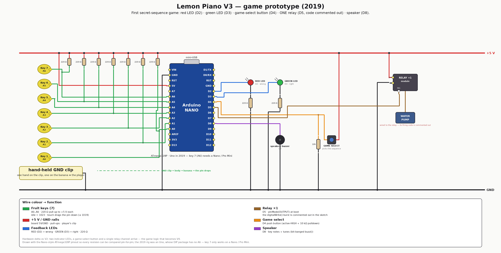

# V3 — game prototype (2019)

The board where the piano becomes a **game**: guess a secret 10-note sequence,
with a red/green LED telling you whether each note was right. Both secret codes
that V4 and V5 still use were fixed here.

**Hardware delta vs [V2](../v2-keyboard-test/):** four parts arrive — a **red
LED (D2)**, a **green LED (D3)**, a **game-select push button (D4)** and a
**single relay channel (D5)** with its load. The keyboard is untouched.

<div align="center">

</div>

## How it plays

1. **Pick the game** with the D4 button at start-up (held HIGH = game 1).
2. **Touch fruit** — each key plays its note (the note *set* switches with the
   game, so the same 7 keys cover two octaves).
3. **Guess the sequence.** A correct note lights the **green** LED and advances
   the sequence; a wrong one lights the **red** LED and resets it. LEDs clear
   after a delay counted in loop iterations.
4. Complete the sequence → the theme plays through the speaker.

### Secret codes (spoilers)

Keys numbered 1–7, left to right — the same codes that survive into V4/V5:

| Game | Melody | Code |
|---|---|---|
| 1 | Super Mario Bros — Main Theme | `6, 5, 6, 7, 2, 5, 2, 1, 3, 4` |
| 2 | Super Mario Bros — Underworld | `3, 6, 1, 4, 2, 5, 3, 6, 1, 4` |

| Key | 1 | 2 | 3 | 4 | 5 | 6 | 7 |
|---|---|---|---|---|---|---|---|
| Game 1 note | E6 | G6 | A6 | B6 | C7 | E7 | G7 |
| Game 2 note | A3 | A#3 | C4 | A4 | A#4 | C5 | D5 |

> **The relay is wired but silent.** `pinMode(relay, OUTPUT)` runs at boot, yet
> the only `digitalWrite(relay, …)` burst in the sketch sits inside a commented
> block. So the channel is on the board and initialised, but nothing fires it —
> the water-pump penalty becomes real in [V4](../v4-water-pump/), with a second
> channel and a trigger condition.

Known rough edges of this prototype (all cleaned up in V4, see
[../../CHANGELOG.md](../../CHANGELOG.md) 2026-07-12): LED timeout counted in loop
iterations, no debounce/edge detection, melodies in RAM, `sequenceLength = 9`
("sequence length − 1"), and the inverted-threshold sensing inherited from V1.

## Firmware

```bash
cd firmware
pio run                 # nanoatmega328 (default) — the env with a working key 7
pio run -e uno          # the historical board; A6 (key 7) does not exist on it
pio run -t upload
```

RAM is tight here (≈ 706 B / 34 % on the Uno env) because every melody lives in
RAM — V4's `PROGMEM` move drops the same game to 309 B.

## Emulation

None — see [emulation/README.md](emulation/README.md). Of the three 2019 boards
this is the one worth emulating first: it has a real game to assert on.

## Files

| Path | What |
|---|---|
| [firmware/game-prototype/game-prototype.ino](firmware/game-prototype/game-prototype.ino) | the sketch (notes + melodies inlined) |
| [HARDWARE.md](HARDWARE.md) | pin map, BOM, wiring detail |
| [images/wiring-v3.png](images/wiring-v3.png) | wirewright-rendered wiring |

**Next revision:** [V4 — water pump](../v4-water-pump/) — the 02/2019 lemon
build: Nano, clip flipped to +5 V, second relay channel, restart button, and the
pump that actually sprays you.
