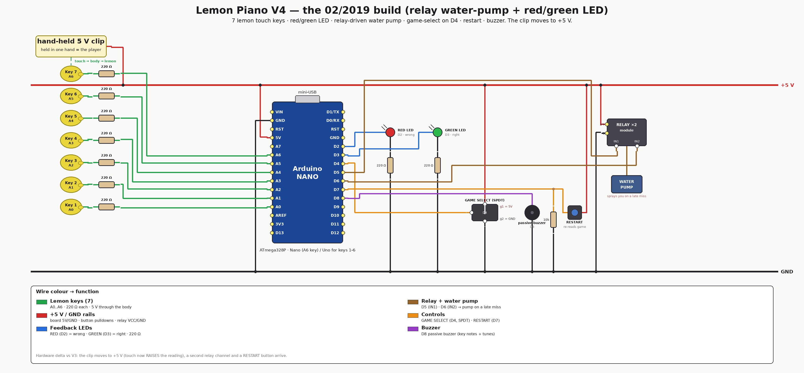

# V4 — lemon piano with the water pump (02/2019)

The university build: bananas become **lemons**, the Uno becomes a **Nano**, the
player's clip moves to **+5 V**, and a **relay-driven water pump** sprays you
when you miss late in the sequence. Ten penalties and the Mario death tune plays
until you hit RESTART.

**Hardware delta vs [V3](../v3-game-prototype/):**

- the hand-held clip flips from **GND to +5 V**, and the 220 Ω resistors move
  from pull-ups to **series resistors** — pins now float near 0 and a touch
  *raises* the reading (the sensing inversion);
- a **second relay channel** (D5 + D6) drives a real **water pump**;
- a **RESTART button** on D7;
- game select becomes a proper **SPDT switch** on D4;
- board: **Arduino Nano** (A6 is now genuinely required for key 7).

<div align="center">

</div>

## How it plays

1. **Power on / RESTART (D7).** The D4 switch picks the game: HIGH = game 1
   (Mario Main Theme), LOW = game 2 (Underworld). `calibrate()` samples each
   key's floating baseline — hands off the lemons at boot.
2. **Touch lemons.** Hold the 5 V clip in one hand, touch a lemon with the other;
   your body closes the circuit and the note plays on the buzzer.
3. **Guess the 10-note secret melody.** Correct note → **green LED**; wrong note
   → **red LED** and the sequence restarts from the first note.
4. **Miss from note 7 onward → the pump fires** for 1 s (`PUMP_FROM_STEP = 7`).
5. **Ten penalties (`MAX_FAILS = 10`)** → the death tune plays and the game is
   over until RESTART.
6. **All ten notes right** → the victory theme plays.

### Secret codes (spoilers)

| Game | Melody | Code |
|---|---|---|
| 1 | Super Mario Bros — Main Theme | `6, 5, 6, 7, 2, 5, 2, 1, 3, 4` |
| 2 | Super Mario Bros — Underworld | `3, 6, 1, 4, 2, 5, 3, 6, 1, 4` |

| Key | 1 | 2 | 3 | 4 | 5 | 6 | 7 |
|---|---|---|---|---|---|---|---|
| Game 1 note | E6 | G6 | A6 | B6 | C7 | E7 | G7 |
| Game 2 note | A3 | A#3 | C4 | A4 | A#4 | C5 | D5 |

## Firmware

This is the 02/2019 game with the 2026-07-12 fix pass applied (TODO #1–#12:
edge-triggered input, `millis()` timing, `PROGMEM` melodies, auto-calibrated
touch, no UART clobber) — and **nothing after that**. This is also the last board
with the water pump: [V4.5](../v4.5-margin-buttons/) removes the relay pair and the
pump, and adds the touch-tuning buttons.

Touch threshold here is the simple form: `threshold = baseline + TOUCH_MARGIN`
with `TOUCH_MARGIN = 100`, calibrated once at boot.

```bash
cd firmware
pio run                          # nanoatmega328 (default, old bootloader)
pio run -e nanoatmega328new      # Nano with the new bootloader
pio run -e uno                   # keys 1-6 only (Uno DIP has no A6)
pio run -e emulation             # compile-check the VELXIO_EMULATION shim
pio run -t upload
pio device monitor               # 9600 baud — logs Game/OK/WRONG/WIN
```

RAM 309 B (15 %), flash 7 296 B (24 %) on `nanoatmega328`.

## Emulation — ✅ verify green

Real firmware on an emulated ATmega328 in the browser, with clickable lemons, the
red/green LEDs and a blue **pump indicator** LED standing in for the relay pair:

```bash
cd .                              # from this version directory
PIPE=../../../velxio-multi-board-emulator/harness/.venv/bin/velxio-pipeline
$PIPE stack up                    # then import emulation/lemon-piano.vlx at http://localhost:3080/editor
$PIPE run --mode verify --spec emulation/lemon-piano.yaml --out emulation/runs
```

`verify` injects game 2's secret code and asserts the firmware boots
(`Lemon Piano V4`), picks `Game 2`, flashes the green LED, sings, and logs `WIN`.
Last run: **pass** (2026-07-26). Details and the browser pin map:
[emulation/README.md](emulation/README.md).

## Files

| Path | What |
|---|---|
| [firmware/src/main.cpp](firmware/src/main.cpp) | the V4 game + the Velxio input shim |
| [firmware/include/notes.h](firmware/include/notes.h) | note frequency table |
| [emulation/lemon-piano.yaml](emulation/lemon-piano.yaml) | circuit spec (source of truth) |
| [emulation/lemon-piano.vlx](emulation/lemon-piano.vlx) | generated project — import into Velxio and Run |
| [HARDWARE.md](HARDWARE.md) | pin map, BOM, wiring detail |
| [images/wiring-v4.png](images/wiring-v4.png) | wirewright-rendered wiring |

**Next revision:** [V4.5 — margin buttons](../v4.5-margin-buttons/) takes the
relay pair and the water pump **off** the board and adds two buttons that tune
touch sensitivity without a reflash.
