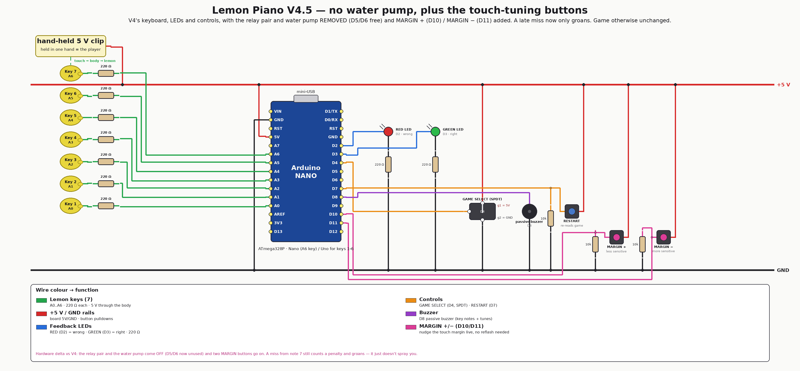

# V4.5 — no water pump, plus the touch-tuning buttons (2026)

V4's game — the same 10-note secret melodies, the same red/green LED feedback, the
same penalty counter and death tune — on a board that **dropped the relay pair and
the water pump** and gained **two buttons for tuning touch sensitivity while you
play**. Fruit, hands, power supplies and mains noise all move the touch threshold;
before this revision the only fix was a reflash.

**Hardware delta vs [V4](../v4-water-pump/):**

- **off** the board: the **2-channel relay module and the water pump** — D5 and D6
  are now unused. A miss from note 7 onward still counts a penalty and plays the
  low warning groan; it just doesn't spray you;
- **on** the board: **MARGIN + on D10** (less sensitive) and **MARGIN − on D11**
  (more sensitive), wired active-HIGH exactly like RESTART (button → 5 V + 10 kΩ
  pulldown). The matching firmware change (noise-adaptive calibration) needs no
  wiring at all.

<div align="center">

</div>

## How it plays

Exactly like [V4](../v4-water-pump/README.md) — pick the game with the D4 switch,
touch lemons, guess the 10-note melody, green LED = right / red = wrong — with
these differences:

| | V4 | V4.5 |
|---|---|---|
| Miss from note 7 (`PENALTY_FROM_STEP`) | low groan **+ 1 s of water pump** | low groan only (`playPenalty()`) |
| Ten penalties (`MAX_FAILS = 10`) | death tune until RESTART | unchanged |
| Touch threshold | `baseline + 100` (fixed `TOUCH_MARGIN`) | `baseline + max(40, 3 × measured noise)`, capped at 900 |
| Calibration runs | at boot | at boot **and on every RESTART** |
| Live tuning | none (reflash) | **MARGIN +/− buttons**, ±10 per press, applied on top of every key's auto margin |

Constants: `MIN_TOUCH_MARGIN = 40`, `NOISE_FACTOR = 3`, `THRESHOLD_CAP = 900`,
`MARGIN_STEP = 10`, `PENALTY_MS = 1000`. Keep hands off the lemons during boot and
after a RESTART — that is when the baseline and noise are sampled.

### Secret codes (spoilers)

| Game | Melody | Code |
|---|---|---|
| 1 | Super Mario Bros — Main Theme | `6, 5, 6, 7, 2, 5, 2, 1, 3, 4` |
| 2 | Super Mario Bros — Underworld | `3, 6, 1, 4, 2, 5, 3, 6, 1, 4` |

| Key | 1 | 2 | 3 | 4 | 5 | 6 | 7 |
|---|---|---|---|---|---|---|---|
| Game 1 note | E6 | G6 | A6 | B6 | C7 | E7 | G7 |
| Game 2 note | A3 | A#3 | C4 | A4 | A#4 | C5 | D5 |

## Firmware

```bash
cd firmware
pio run                          # nanoatmega328 (default, old bootloader)
pio run -e nanoatmega328new      # Nano with the new bootloader
pio run -e uno                   # keys 1-6 only (Uno DIP has no A6)
pio run -e emulation             # compile-check the VELXIO_EMULATION shim
pio run -t upload
pio device monitor               # 9600 baud — logs Game/OK/WRONG/WIN + margin changes
```

The relay code is **gone, not disabled**: no `RELAY_1`/`RELAY_2` pins, no
`pumpOff()`, no `firePump()`. `playPenalty()` replaces the last one and only makes
noise. All four envs build green.

## Emulation — ✅ verify green

The V4 browser circuit minus the blue pump-indicator LED (**the MARGIN buttons are
hardware-only** — D11 is the buzzer in the browser build and there are no pins to
spare), compiling *this* version's firmware, so the emulation also exercises the
noise-adaptive calibration path:

```bash
PIPE=../../../velxio-multi-board-emulator/harness/.venv/bin/velxio-pipeline
$PIPE run --mode verify --spec emulation/lemon-piano.yaml --out emulation/runs
```

`verify` injects game 2's secret code and asserts `Lemon Piano V4.5` → `Game 2` →
green LED → buzzer → `WIN`. Last run: **pass** (2026-07-26). Browser pin map and
the shim rationale: [emulation/README.md](emulation/README.md).

## Files

| Path | What |
|---|---|
| [firmware/src/main.cpp](firmware/src/main.cpp) | V4's game without the pump + noise-adaptive calibration + MARGIN buttons |
| [firmware/include/notes.h](firmware/include/notes.h) | note frequency table |
| [emulation/lemon-piano.yaml](emulation/lemon-piano.yaml) | circuit spec (source of truth) |
| [emulation/lemon-piano.vlx](emulation/lemon-piano.vlx) | generated project — import into Velxio and Run |
| [HARDWARE.md](HARDWARE.md) | pin map, BOM, wiring detail |
| [images/wiring-v4.5.png](images/wiring-v4.5.png) | wirewright-rendered wiring |

**Next revision:** [V5 — ten-LED bar](../v5-led-bar/) strips the red LED *and*
these two buttons, and spends every freed pin on a ten-LED progress bar.
