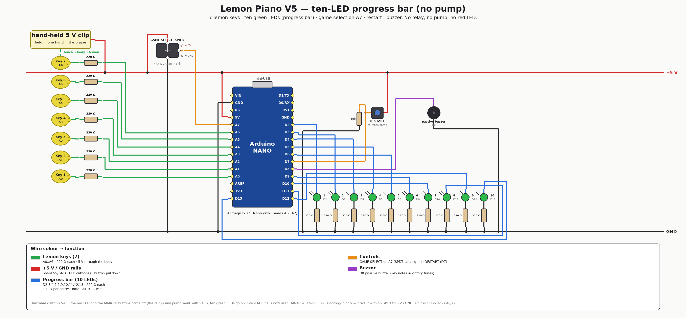

# V5 — ten-LED progress bar (2026) — newest board

No relays, no pump, no red LED, no fail counter: a row of **ten green LEDs** is
the entire feedback surface. Each correct note lights the next LED, a wrong note
blanks all ten, and lighting the tenth wins — the theme plays with the bar
flashing to the beat, then the game **auto-advances** to the other tune.

> **Rebuilt on 2026-07-28.** This board replaces the original V5 board *in place*,
> at the owner's request, rather than becoming a new version. The previous V5
> (floating +5 V-clip keyboard, A7 game-select switch, D7 restart button) is
> recoverable from git history and described in [../../CHANGELOG.md](../../CHANGELOG.md).

**Hardware delta vs [V4.5](../v4.5-margin-buttons/):**

- **the keyboard returns to the 2019 arrangement**: each key is pulled **up** to
  +5 V through 220 Ω and the player holds a **GND** clip, so a touch drags the
  reading **down**. This is what made the keyboard readable at all — the
  measurements are in [HARDWARE.md](HARDWARE.md);
- **off** the board: the red LED, the two MARGIN buttons, the **game-select
  switch** and the **restart button** (relays and pump left with V4.5);
- **on** the board: **ten green LEDs in one ascending run, D2 → D11** (LED n on
  pin n+1, so the bar wires left to right with nothing to look up) and **two
  sensitivity buttons** — **SENS + on D12**, **SENS − on A7**. The buzzer moves to
  **D13**;
- board: **Arduino Nano only** — A6 is key 7 and A7 is a button, and a classic Uno
  exposes neither.

<div align="center">

</div>

## How it plays

1. **Power on → auto-calibration.** It measures every key's resting level *and*
   its idle noise, running the LED bar across as it goes (**LEDs moving = hands
   off the fruit**), derives the touch margin from the measured noise, chirps when
   done, and shows the chosen sensitivity on the bar. The game starts at **game 1**
   and auto-advances on each win, so both themes are reachable with no switch.
2. **Touch lemons.** Hold the **GND** clip in one hand and touch a lemon with the
   other — your body drags that pin down and the note plays on the buzzer.
3. **Play freely.** While the bar is empty, every key just sounds its note —
   no wrong tone, no penalty. It is a piano; noodle as long as you like.
   **Hold a lemon and its note keeps sounding** for as long as you touch it (a
   quick tap still gets a full 70 ms note), and **pressing the same lemon again
   never counts twice** — only the first press of a key reaches the game, until
   you play a different one. Flaky fruit contact can no longer machine-gun
   guesses.
4. **The puzzle starts when you hit the code's first note** (LED 1 lights). From
   there each correct note lights the next green LED (the bar climbs 1 → 10),
   and a wrong note **blanks all ten** and drops you back to free play. The low
   "wrong" tone plays **after** the note you pressed has finished — you always
   hear which key was wrong, then the buzz.
5. **Victory + auto-advance.** Light all ten → the **flagpole fanfare** plays,
   then that level's own theme with the bar flashing per note, then the game moves
   to the **next level** (1 → 2 → 3 → 4 → 1 …). Clearing level 4 plays the
   **ending melody** first.
6. **Tune sensitivity while you play**: **D12** = more sensitive, **A7** = less
   sensitive, 1-count steps (5 above margin 20), auto-repeat while held. The bar
   shows the level for a moment after each press, and the tick's pitch tracks the
   setting — so you can see *and* hear where it is.
7. **Smart adjust**: hold **both buttons for 1 s while touching a lemon**. It
   works out which lemon your finger is on, measures how far the other channels
   wander meanwhile, and sets the margin midway between the two — the cleanest
   separation your fruit can currently give. The bar fills as it samples; a rising
   triad means it learned, a falling pair means the touch could not be told from
   noise and **nothing changed**.
8. **No restart button.** Recalibrate with the smart-adjust gesture or a reset.

Every state has its own sound, all of them **above** the game notes (3.3–4.7 kHz,
where a piezo is loudest) so a chirp is never mistaken for a note: calibration
start/finish, button ticks, end-stop, smart-adjust progress/success/failure, and a
warble if a key gets stuck reading touched and is re-baselined.

### Four levels, four themes (spoilers)

Each level has its own seven key notes, its own 10-note code, and its own theme
played on the win. Clear level 4 and the **ending melody** plays before it wraps
back to level 1.

| Level | Theme | Code |
|---|---|---|
| 1 | Overworld / Main Theme | `6, 5, 6, 7, 2, 5, 2, 1, 3, 4` |
| 2 | Underworld | `3, 6, 1, 4, 2, 5, 3, 6, 1, 4` |
| 3 | Underwater | `2, 4, 6, 1, 5, 3, 7, 4, 2, 6` |
| 4 | Starman | `5, 1, 3, 7, 2, 6, 4, 1, 5, 3` |

| Key | 1 | 2 | 3 | 4 | 5 | 6 | 7 |
|---|---|---|---|---|---|---|---|
| Level 1 | E6 | G6 | A6 | B6 | C7 | E7 | G7 |
| Level 2 | A3 | A#3 | C4 | A4 | A#4 | C5 | D5 |
| Level 3 | C5 | C#5 | D5 | E5 | F5 | G5 | A5 |
| Level 4 | C5 | D5 | E5 | F5 | G5 | A5 | C6 |

A level's seven notes are always distinct (the game recognises a guess by
frequency), and no code repeats a note back-to-back (a repeated press of the same
key is filtered as flaky contact).

### The sounds are Mario's

Every non-key sound is a Super Mario Bros effect — see
[../../docs/MARIO-SOUNDS.md](../../docs/MARIO-SOUNDS.md) for the note data and
where each one came from:

| Moment | Sound |
|---|---|
| Calibration starts | fireball whoosh |
| Each key measured | **a coin** (seven coins = seven keys) |
| Calibration finished | **mushroom power-up** |
| Sensitivity button | coin grace-note tick, pitch tracks the margin |
| Knob at its end stop | bump (head on a block) |
| Smart adjust listening | a coin per sampling burst |
| Smart adjust learned | **1-up** |
| Smart adjust failed | **death rattle** |
| Level complete | **flagpole fanfare**, then that level's theme |
| All four levels clear | **ending melody** |

Touch sensing is the V2.5 front end: `threshold = baseline − margin`, with the
baseline measured at boot and tracked while each key is untouched, and the margin
auto-derived as `max(4, 2 × worst measured noise)`. On this rig that lands on
**margin 4 → threshold 1018**, which is the working point measured by hand.

## Firmware

```bash
cd firmware
pio run                          # nanoatmega328 (default, old bootloader)
pio run -e nanoatmega328new      # Nano with the new bootloader
pio run -e emulation             # compile-check the VELXIO_EMULATION shim
pio run -t upload
pio device monitor               # 9600 baud — logs Game/OK n/10/WIN
```

There is no `uno` env: V5 needs A6 (key 7) + A7 (SENS −).

### Pin map at a glance

```
A0..A6   keys 1..7      220 Ω pull-up each; player holds the GND clip
D2..D11  LEDs 1..10     LED n on pin n+1 — one run, in order
D12      SENS +         button to GND (internal pull-up)
D13      buzzer         on-board LED blinks along with the audio
A7       SENS −         button to GND + external 10 kΩ pull-up
```

## Emulation — ✅ verify green

```bash
PIPE=../../../velxio-multi-board-emulator/harness/.venv/bin/velxio-pipeline
$PIPE stack up                    # then import emulation/lemon-piano.vlx at http://localhost:3080/editor
$PIPE run --mode verify --spec emulation/lemon-piano.yaml --out emulation/runs
```

Clickable lemons (or press `1`–`7` on your keyboard), audible buzzer, the ten-LED
bar. Because ten LEDs use every free browser pin there is **no game-select switch
and no restart button**: it starts at game 1 and auto-advances on each win.
There are **four** headless specs, all green (2026-07-27, +1 on 2026-07-29):

| Spec | What it proves |
|---|---|
| `emulation/lemon-piano.yaml` | free play → first note → a miss (`WRONG`) → the full code (with the first note pressed twice, to show the repeat filter doesn't eat real guesses) → `WIN` → auto-advance to `Game 2`, plus the victory light show |
| `emulation/free-play.yaml` | five keys that are *not* the code's first note: the buzzer sings, but `WRONG` and `OK` never appear and LED 1 never lights |
| `emulation/hold-and-repeat.yaml` | one key held 600 ms then tapped three more times: the note sustains with the touch (584 ms measured), and four touches produce exactly one `OK 1/10` — no `OK 2/10`, no `WRONG` |
| `emulation/all-levels-win.yaml` | a scripted "virtual button" that plays all **four** levels' secret codes back to back — the only test that has ever exercised levels 3 and 4 (added the day before this spec). Asserts `WIN` -> `Level 2` -> `WIN` -> `Level 3` -> `WIN` -> `Level 4` -> `WIN` -> `ALL LEVELS CLEAR` -> wraps to `Level 1`, zero `WRONG`s |

There's also a **live, pressable** version for manual testing —
`emulation/autoplayer.yaml`: a second Arduino (Uno) sharing the canvas, with a
LEVEL SELECT button (cycles 1-4, LEDs show which) and a PLAY button that fires
that level's code onto the lemons' own key nodes, on demand, as many times as
you like. Multi-board specs only run in `--mode interactive` in this harness
(no headless verify/document for them), so open it in the browser:

```bash
$PIPE run --mode interactive --spec emulation/autoplayer.yaml --out emulation/runs --open
```

Details, pin map and the two boards' full sketches:
[emulation/README.md](emulation/README.md#files).

```bash
$PIPE run --mode verify --spec emulation/free-play.yaml --out emulation/runs
$PIPE run --mode verify --spec emulation/hold-and-repeat.yaml --out emulation/runs
$PIPE run --mode verify --spec emulation/all-levels-win.yaml --out emulation/runs
```

> **A code can never repeat a note back-to-back** now that same-key repeats are
> filtered. Neither of the two codes does (`6,5,6,7,2,5,2,1,3,4` and
> `3,6,1,4,2,5,3,6,1,4`) — check it if you ever add a third.

Full details, key mapping and the pin-map diff:
[emulation/README.md](emulation/README.md).

## Files

| Path | What |
|---|---|
| [firmware/src/main.cpp](firmware/src/main.cpp) | the V5 game (10-LED bar, auto-advance) + Velxio shim |
| [firmware/include/notes.h](firmware/include/notes.h) | note frequency table |
| [emulation/lemon-piano.yaml](emulation/lemon-piano.yaml) | circuit spec (source of truth) |
| [emulation/lemon-piano.vlx](emulation/lemon-piano.vlx) | generated project — import into Velxio and Run |
| [HARDWARE.md](HARDWARE.md) | pin map, BOM, wiring detail |
| [images/wiring-v5.png](images/wiring-v5.png) | wirewright-rendered wiring |

**Next revision:** none yet — this is the newest board. Modify the hardware and
you start V6: the recipe is in
[../../docs/VERSIONING.md](../../docs/VERSIONING.md).
