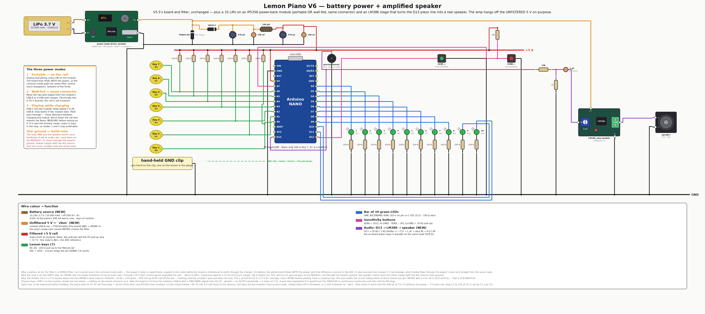

# V6 — battery power + amplified speaker

> **STATUS: PROPOSAL UNDER MEASUREMENT. Not a complete version directory, not
> built.** This folder holds the wiring contract's render plus the
> [`bench/`](bench/) instruments and protocol for qualifying the power source.
> It deliberately does **not** yet have `firmware/`, `emulation/` or
> `HARDWARE.md` — see [What is missing](#what-is-missing).
> The newest *real* board is still [V5.5](../v5.5-power-filter/).

<div align="center">

</div>

## The hardware delta vs V5.5

Two additions; the V5.5 board, filter and pinout are untouched.

| Added | Part | Where it lands |
|---|---|---|
| Power source | 1S LiPo 3.7 V / 10 000 mAh (`1260110`) + IP5356 power-bank driver module | the module's USB-A output replaces the wall charger on the same 2-pin `5V IN` header (PCB J1) |
| Audio stage | LM386 mono amp module + 4 Ω 3 W speaker, behind a 10 kΩ / 1 kΩ divider and a 1 µF coupling cap | in parallel with the buzzer on `/BUZZER` (PCB J5) |

Nothing on the PCB changes: [ADR-025](../../pcb/docs/DECISIONS.md) already made
`5V IN` a 2-pin header sized for "a chopped USB-A pigtail", and
[ADR-034](../../pcb/docs/DECISIONS.md) already put `SPK` (J5) in parallel with
the buzzer. **Swapping which port the pigtail plugs into is the whole mode
switch** — power bank for portable, wall charger for mains.

## The two design decisions worth reading

**1. The amplifier hangs off the UNFILTERED 5 V (`vbus`), not the rail.**
An LM386 into 4 Ω pulls hundreds of mA at audio rate. The V5.5 CLC pi has
fc ≈ 730 Hz, so at 1 kHz it attenuates by only ~5 dB — audio-band current drawn
*through* the filter would land almost unattenuated on the filtered rail, which
**is** AVcc, the reference the 3-4-count (15-20 mV) touch margin is measured
against. So the amp taps the module's output *before* the TVS, sharing no series
element with the keyboard. This is why the `+5 V` rail in the diagram stops
short of the audio block instead of spanning the canvas: it is not there.

Corollary for the build: the amp's ground and the speaker return go back to the
**module's** G, never through the board's ground. Shared copper with the key
returns puts the music straight onto the sense node.

**2. D13 drives a divider, not the coil.** A bare 4-8 Ω speaker on D13 would
destroy the pin (ADR-034). 10 kΩ / 1 kΩ turns the 5 V square wave into ~450 mV
(0.45 mA off the pin), the 1 µF blocks its 2.5 V DC average, and the module's
gain pot does the rest. The on-board piezo stays wired in parallel on the same
node, exactly as J5 defines it — keep it or omit it.

## Why a battery is more than portability

The V5.5 filter is a **series** filter, so by construction it cannot touch the
common-mode path: the player's body is capacitively coupled to the mains while
the board is referenced to earth through the charger, and that difference falls
across the body → lemon → pin loop. On battery the whole board floats *with* the
player and the difference cancels in the ADC. It also removes the charger's
Y-cap leakage (0.1-0.35 mA at 50 Hz) which today flows through the player's hand
and into the sense node. **Expect battery mode to be quieter than mains, not
merely as quiet.**

## Open risks — measure before building

| Risk | Why | If it bites |
|---|---|---|
| **Low-load auto-shutdown** | the piano idles at 25-35 mA (free play = all ten LEDs dark); IP5356-class modules cut the output below ~45-75 mA | module's low-current mode · a keep-alive LED in firmware · 100 Ω bleeder on `vbus` |
| **QC/PD overvoltage** | a port that negotiated 9 V would put the P6KE6.8A into continuous conduction (it is a transient part, 600 W for 1 ms) — it burns, then the ATmega does | USB-A only, two-wire pigtail only (no D+/D− → no handshake) |
| **Inrush into 940 µF** | C1 + C3 look like a short to a boost whose short-circuit protection reacts in < 50 µs | drop C1 to 220 µF — `fc` is set by C3, not C1 |
| **No battery telemetry** | A0-A7 and D2-D13 are *all* used; there is no free pin | the module's own 2-digit display is the gauge |
| **Pouch vs THT leads** | the solder side is a field of cut leads; a LiPo pouch pressed against it is a puncture risk | rigid spacer or a separate compartment (the 4 × M2 holes are there) |

## Bench protocol — start here

The power source gets measured **before** it touches a board.
[`bench/`](bench/) holds two Nano-based instruments (`psu-probe`,
`touch-noise`) and the T0-T7 protocol with pass/fail criteria, written for the
current state: cell on the module, KWS-X1 on hand, no PCB yet. T2 (the low-load
cut-off) and T7 (battery vs mains noise) are the two that decide whether V6 is
worth building.

## Regenerating the diagram

The contract is `build_v6()` in
[`tools/wiring_diagrams.py`](../../tools/wiring_diagrams.py), routed and
DRC-validated by the [wirewright](https://github.com/yupipi93/eda-wirewright)
engine — never hand-drawn:

```bash
python3 tools/wiring_diagrams.py v6     # → 66 nets, DRC 0 violations
```

It uses four component factories added to the engine for this board:
`battery`, `power_bank_module`, `amp_module`, `speaker` (plus `deco.panel`).

## What is missing

To become a real version per [docs/VERSIONING.md](../../docs/VERSIONING.md) this
directory still needs:

- [ ] `firmware/` — a copy of V5.5's, plus whatever the low-load fix turns out
      to need (a keep-alive LED is a firmware change, and it costs one LED of
      the progress bar's semantics — that is a design call, not a mechanical one)
- [ ] `emulation/` — or a README saying why this board has no emulation
- [ ] `HARDWARE.md` — pin map + full BOM + the bench-validation recipe
- [ ] a row in [`versions/README.md`](../README.md) and the root README table
- [ ] **measurements**: the module's cut-off current, its inrush behaviour, and
      the 20-light-switch-flip noise comparison (mains vs battery vs charging)
      from [V5.5's bench recipe](../v5.5-power-filter/HARDWARE.md)
